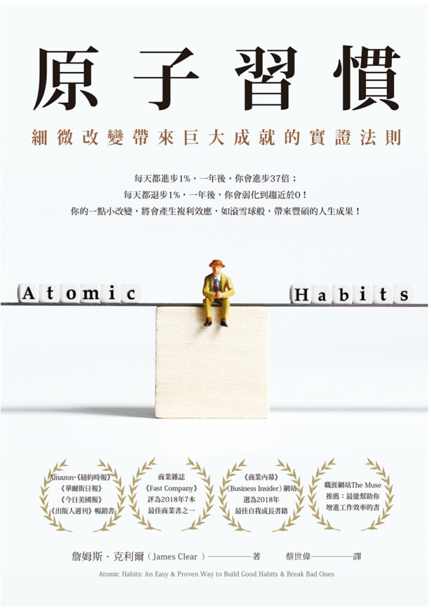

Title: [Book] 原子習慣
Date: 2020-01-02 21:30
Category: Book
Tags: Productivity
Slug: atmoic-habit
Authors: Lee-W

終於把之前很多人在討論的這本書看完了
也許是太久沒看書了，看書的速度下降了很多
上一次好好看完一本書竟然是九月初的事了＠＠

整體來說，這本書在講的跟[為什麼我們這樣生活，那樣工作 ?](https://lee-w.github.io/posts/book/2015/11/the-power-of-habit/)差不多
但文字上淺顯易懂了很多

<!--more-->

[TOC]

* 「習慣的四階段模型」
    1. 提示
    2. 渴望
    3. 回應
    4. 獎賞

## 基本原理 - 為何細微改變會帶來巨大差既
### 1. 原子習慣的驚人力量
* 造就成功的，是日常習慣，而不是千載難逢的轉變
* 如果花太多時間思考目標，卻花太少時間設計系統，會遇到這些問題
    1. 贏家跟輸家擁有同樣的目標
    2. 目標達成不過是短暫的改變
        * 目標的達成只能暫時改變你的生活
        * 結果並非問題所在，應該改變的是造成那些結果的系統
    3. 目標限制了你的快樂
    4. 目標與長期進步互相矛盾
        * 設定目標的目的是贏得比賽，建立系統的目的則是持續待在比賽裡
* 在跨越關鍵門檻之前，小改變往往看似無足輕重。所有複利過程的強大成果總是遲來，你要有耐性

### 2. 改變習慣最有效的方法，是改變身份認同
* 改變的發生分成三個層次
    1. 結果
    2. 過程
    3. **身分認同**
        * 改變信念： 世界觀、你的自我形象、你對自己與他人的評價
        * 在成為自我身分的一部分之前，改善都只是暫時的
            * 目標不是讀一本書，而是成為讀書的人
            * 目標不是跑一趟馬拉松，而是成為跑步的人
        * 你之所以相信你現在的身份認同是因為你有證據
            * 假如你每週日都上教堂，你就有證據證明自己是個虔誠的人
        * 新的身分認同需要新的證據
            1. 決定你想要成為什麼樣的人
            2. 透過生活中的小勝利來向自己證明

### 3. 四個簡單的步驟，讓你建立更好的習慣
* 習慣可以讓你騰出自由思考與創意所需的心理空間
* 每當你想要改變一個行為
    1. 我要怎麼讓提示顯而易見？
    2. 我要怎麼讓習慣有吸引力？
    3. 我要怎麼讓行動輕而易舉？
    4. 我要怎麼讓獎賞令人滿足？

## 法則 1 - 讓提示顯而易見
### 4. 行為改變的過程始於察覺
* 習慣記分卡
    * Why
        * 幫助你覺察自身習慣
        * 行為愈是自動化，愈難有意識地想到它，也愈容易出錯
        * 個人生活中，也需要[指差確認](https://zh.wikipedia.org/wiki/%E6%8C%87%E5%B7%AE%E7%A2%BA%E8%AA%8D)系統
    * How
        * 列出每日習慣的清單
        * 「這是好習慣、壞習慣，或是不好不壞的習慣？」
            * 好習慣: 標上正號（＋）
            * 壞習慣: 標上負號（－）
            * 不好不壞:  標上等號（＝）
        * 如何判斷好習慣還壞習慣 → 「這個習慣能幫助我成為我想要成為的那種人嗎？對於我渴望的身分認同，這個習慣投的是同意票或反對票？」
        * 目標只是要注意到實際發生的行為，請**不帶評價或批判地觀察自己的想法與行動**
* 改變惡習的第一步，就是密切注意它們
    * 如果覺得需要額外的協助，可以嘗試在生活中執行指差確認，*大聲說出你打算做的事，以及可能的結果*

### 5. 開始一個新習慣最好的方法
* 執行意向: **我會於〔時間〕，在〔地點〕進行〔行為〕**
    * 對何時何地執行一項新習慣做出確切計畫的人，比較可能真的去執行
    * 確切知道自己想要什麼、如何達成目標，可以幫助你拒絕干擾你前進、令你分心、讓你脫離軌道的事物
* 習慣堆疊: **「做完〔目前的習慣〕之後，我會執行〔新的習慣〕。」**
    * 先找出自己目前的每日習慣，然後把新的行為堆疊上去
    * 修正習慣堆疊，讓時間點明確：
        * e.g., 「午餐休息時，我會做十下伏地挺身。」 → 「當我闔上筆電、準備去吃午餐時，我會在書桌旁做十下伏地挺身。」

### 6. 激勵被高估了，環境往往更重要
* 情境是觸發習慣的提示
* 比起在相互牴觸的提示中建立新習慣，把新習慣跟一個全新的情境連結在一起比較容易
    * 如果你每晚都在臥室看電視，想要早點就寢可能很難
    * 如果客廳是你打電動的地方，想要在那裡專心讀書可能很難
        * 步出平常的環境，你就把那些行為偏誤拋在腦後了。你不必對抗舊環境裡的提示，新習慣的形成也就不受干擾了
* 一個空間，一個用途: 倘若無法移動到全新的環境，就重新定義或重新整理當前的環境，為工作、讀書、運動、娛樂與烹飪區隔出不同的空間
* 盡量避免把一個習慣的情境跟另一個習慣的情境混在一起
    * 當情境混合，習慣也會開始混合在一起
    * 到頭來，獲勝的通常是比較輕鬆的

## 法則 2 - 讓習慣有吸引力
### 7. 自制力的祕密
* 所謂「自律者」只是擅長建構生活，好讓自己不需要展現超凡的意志力與自我控制力 → 不常讓自己處於充滿誘惑的情境
    * 可以破除一項習慣，但不太可能忘掉它
        * 習慣的心理紋路一旦被刻進大腦，幾乎不可能完全移除 → 抗拒誘惑是無效策略
        * **短期內，你可以用意志力壓過誘惑；長久下來，我們終歸是所處環境的產物**
    * 要剷除一項壞習慣，最實用的方法之一就是**減少接觸會激發此惡習的提示**

### 8. 如何讓習慣變得難以抗拒
* 習慣堆疊加誘惑綑綁
    1. **做完〔目前的習慣〕之後，我會執行〔我需要的習慣〕**
    2. **做完〔我需要的習慣〕之後，我會執行〔我想要的習慣〕**

### ９　家人與朋友如何形塑你的習慣
* 要打造更好的習慣，最有效的方法之一就是加入一個把你想要的行為視作常態的文化之中。當你看到其他人每天都在做，新習慣便顯得可行
    * 沒有任何事物比「屬於某一族群」的感覺更能支撐動機，這種歸屬感把個人的追求轉化為共同的追求
* 加入的文化應該具備兩個特點
    1. 你想要的行為是常態
    2. 你跟這個群體本來就有某些共同點

### 10　如何找出並解決壞習慣的成因
* 目前的習慣不見得是解決問題的最佳手段，而只是你學會使用的手段
    * 某個人也許學會用抽菸來抒解壓力，另一個人則學會用跑步來減低焦慮
* 與正面感受產生連結之後，習慣就有了吸引力
* 動機儀式: 練習把習慣與你很享受的某件事物聯想在一起，往後每當需要一點動機時，就可以把這個提示拿出來用

## 法則 3 - 讓行動輕而易舉
### 11. 精通習慣由重複開始，而非完美
* 想要精通一項習慣，**關鍵是由重複開始，而非完美**
    * 你不必詳細列出新習慣的所有特徵，只要開始實行就好了

### 12. 最小努力原則
* 讓習慣簡單到就算沒有意願也會執行
    * 創造出一個讓正確的事情盡可能輕而易舉的環境
* 讓好習慣更加方便，你就更有可能貫徹
    * 為了以後方便，把環境準備好

### 13. 如何運用「兩分鐘法則」停止拖延
* 兩分鐘法則：新習慣的開始應該要花不到兩分鐘
    * 幾乎每個習慣都可以縮減為兩分鐘版本：
        * 「每晚就寢前閱讀」變成「讀一頁」
        * 「做三十分鐘瑜伽」變成「拿出瑜伽墊」
        * 「用功讀書」變成「翻開筆記」
    * 在覺得費力之前停止

### 14. 如何讓好習慣變得無可避免，讓壞習慣不可能發生
* 讓違背好習慣比開始執行好習慣更花力氣
    * e.g.,
        * 報名瑜伽課程並提前付款
        * 買一個插座定時器，裝在電源和路由器中間，每天晚上十點，這個定時器會切斷路由器的電源；當網路斷線，就知道上床時間到了

## 法則 4 - 讓獎賞令人滿足
### 15. 行為改變的基本原則
* 行為改變的基本原則： 帶來獎賞的行為會被重複，帶來懲罰的行為會被避免
    * 正面情緒培養習慣，負面情緒摧毀習慣
    * 不是任何一種滿足都好，**我們追求的是立即的滿足**
* 立即獎賞與延遲獎賞之間的不一致
    * *壞習慣的後果被延遲，其獎賞卻是立即的*
* 如何把「立即滿足」變得對你有利
    * 本來就沒有行動時，很難讓人感到滿足。你所做的只是抵抗誘惑，這沒什麼好令人滿足的
    * 一個解決方法是把情況顛倒： **讓避免變得可見**
        * 開一個存款帳戶，然後每跳過一樣東西不買，就在那個帳戶裡存進同等金額的錢
            * 早餐沒點拿鐵？ 轉五美元進去
            * 下個月不訂購 Netflix？ 轉十美元進去
    * 值得注意的是，選擇的短期獎賞必須能夠強化你的身分認同，不能與之牴觸

### 16. 如何每天堅持好習慣
* 習慣追蹤器
    * 最基本的形式就是找一本日曆，只要有執行例行事務，就在那天打個勾
* Why
    1. 顯而易見
        * 記錄上一個行動，可以創造觸發下一個行動的因子
    2. 有吸引力
        * 最有效的激勵就是自己的進步
        * 習慣追蹤可以產生一種成癮效果，每個小勝利都餵養著你的渴望
    3. 令人滿足
        * 習慣追蹤還能幫助你專注於當下所做的事：把焦點放在過程，而非結果
        * 不再執著於練出六塊腹肌，而是試圖讓連續紀錄延續下去，成為從不錯過健身行程的那種人
* 如何在習慣中斷之後快速回復
    * 每當這種情況發生，我就會提醒自己守住一個簡單的原則：不要錯過兩次
    * **問題不在於犯錯，而在於以為只要無法做到完美，就乾脆不要做**
        * 即使只是執行一點，也要執行
        * 在狀態不佳（或忙碌）的一天繼續執行你的習慣，有非常大的價值

### 17.　問責夥伴作用大
* 習慣契約 - 讓違背承諾變成公開且令人痛苦的事
    * 一份口頭或文字的同意書
        * 表明你承諾投入某項特定習慣
        * 未能貫徹時會有的懲罰
        * 找一到兩人來擔任你的「問責夥伴」，與你一同簽署這份契約

### 18　基因如何影響習慣的養成
* 基因決定的不是你的命運，而是你在哪個領域會有機會
* 如何找到對自己有利的賽場
    * 什麼事情對別人來說是勞苦，對我來說卻是樂趣?
    * 什麼事情讓我忘記時間？
    * 什麼事情讓我比一般人得到更多報償？
    * 什麼事情對我來說是自然而然的？
* 當你無法靠著「更好」來贏，可以憑藉「不同」勝出
    * 透過結合自己的各項技能，你把競爭程度降低，讓自己更容易出頭

### 19. 如何在生活與工作中維持動力
* 維持動力並達到欲望最高點的關鍵： 執行「難度恰到好處」的任務
* 如何在感到無聊時保持專注
    * 變動獎賞
        * 但變動獎賞不會創造渴望
            * 不能拿一個人們不感興趣的獎賞，以變動的間隔給，然後希望可以讓他們改變主意，但對於強化原本就有的渴望非常有效，因為變動獎賞能夠減低無聊
* 不管有沒有變動獎賞，任何習慣都無法永遠保持有趣。在自我精進的旅途上，到了某個時間點，每個人都會面對同樣的挑戰： 你必須愛上無聊
* 在討厭的時候、痛苦的時候、筋疲力盡的時候還是挺身繼續，這就是專業人士與業餘者的差別
    * 專業人士堅守既定行程，業餘者接受生活的干擾
    * 專業人士知道什麼事情對自己最重要，帶著決心奮力向前，業餘者則讓生活中的緊急事件拽離正軌

### 20.　建立好習慣的壞處
* 當習慣變得自動化，你對回饋就變得比較不敏感，落入無意識的重複之中
    * 錯誤就比較容易趁虛而入
    * 當你可以不假思索地把事情做得「夠好」，就不會去思考要怎麼樣才能做得「更好」
* **習慣 ＋ 刻意練習 ＝ 精通**
* 作者使用的反省/複查模式
    * 每年十二月，進行「年度審核」，反思過去的一年
        * 為那年的習慣打分
            * 發表了多少篇文章
            * 健身了多少回
            * 造訪了多少個新地方
            * and etc.
        * 問自己以下問題，反思是否有進步
            1. 今年什麼事情很順利？
            2. 今年什麼事情不順利？
            3. 我從中學到什麼？
    * 六月，進行「誠實報告」
        * 重新審視自己的核心價值觀，思考自己是否有依照這些價值觀行事
        * 思索自己的身分認同，看看應該如何努力成為自己想要成為的那種人
        * 問自己以下的問題
            1. 驅動生活與工作的核心價值觀為何？
            2. 現在如何誠實地生活與工作？
            3. 未來如何設定更高的標準？
    * 這兩份報告不會花太多時間，每年幾個小時而已，卻是精細改進的關鍵時期
* 如何破除妨礙你前進的信念
    * 不要讓身分的任何單一面向決定你是誰
