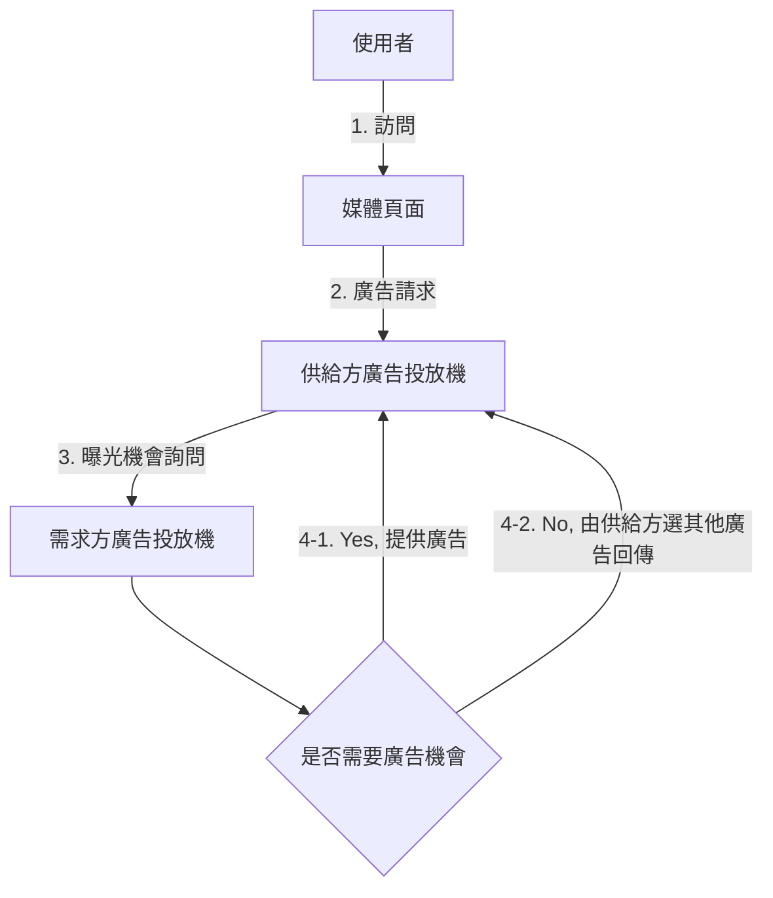
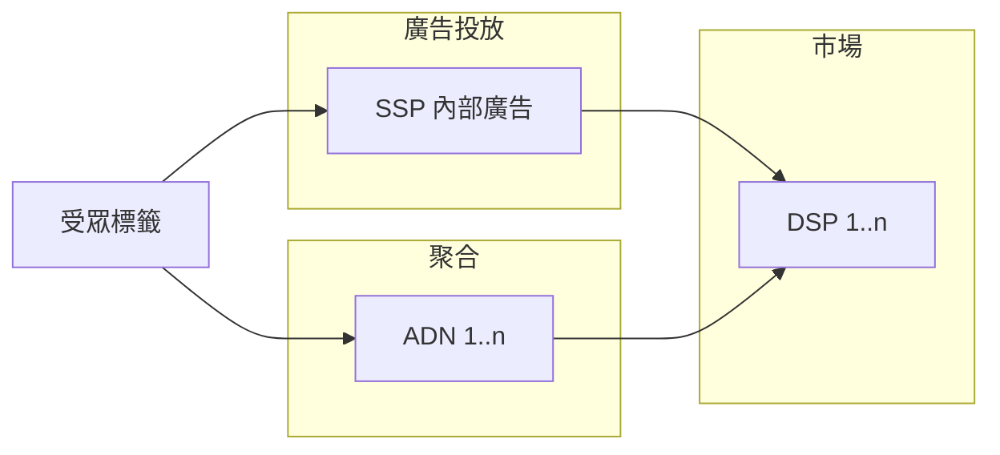
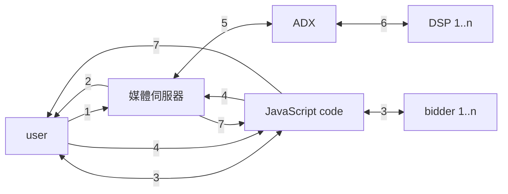

Title: [Book] 計算廣告：互聯網商業變現的市場與技術
Date: 2021-02-13 22:35
Category: Book
Tags: Advertising
Slug: computational-advertising
Authors: Wei Lee
Status: draft

因為原文就是簡體的，所以整個筆記會有中國用語
我用 [opencc-python](https://github.com/yichen0831/opencc-python) 簡轉繁

<!--more-->

[TOC]

## Note

### 常見名詞
* 千次曝光付費（Cost per Mille，CPM)
* 千次曝光期望收入（expected Cost per Mille, eCPM）
* 點擊付費（Cost per Click，CPC）
* 千次曝光收益（Revenue per Mille，RPM）
* 點擊率（Click Through Rate，CTR）: 廣告點擊與廣告展現的比率
* 轉化率（Conversion Rate，CVR）:  轉化次數與到達次數的比例
    * 轉化： 使用者從 landing page 開始，進一步完成下單等操作
* 客戶關係管理（CRM, Customer Relation Management）
* 資料管理平台（DMP, Data Management Platform）

### 前言
* If you can't measure it, you can't manage it.

### Ch 1 線上廣告概述

#### 免費模式
* 免費模式： 將能規模化、客製化傳播資訊的商品，以邊際成本的價格出售
    * 狹義案例： 軟體產品不收費（多一個使用者的邊際成本很小）
    * 廣義案例： 硬體以毛利爲零左右的價格出售（邊際成本 = 量產成本）
* 變現核心資產
    1. 流量
        * e.g., 有人使用你的產品時，你在產品夾帶付費內容（sponsored content）
    2. 資料
    3. 影響力
        * e.g., 近年來迅速崛起的網紅和自媒體

#### 廣告的目的
* 為什麼需要廣告？
    * 通過媒體達到低成本的使用者接觸（"低成本"是與市場或銷售人員的成本相對而言的）
* 廣告分類
    * 品牌廣告（brand awareness）
        * 快速接觸大量使用者，宣傳品牌形象，提升中長期購買率
        * 傳統廣告的主要目的之一
    * 直接效果廣告（direct response）
        * 利用廣告馬上帶來大量的購買或其他轉化行爲

#### 廣告形式
01. 橫幅廣告（banner ad）
02. 文字廣告（textual ad）
    * 提供連到廣告主 landing page 的連結
    * 搜尋廣告的主流形式
03. 富媒體廣告（rich media ad）
    * e.g., 彈跳視窗
    * 適合在高品質的媒體做品牌廣告投放，對使用者的使用體驗影響較大
04. 影片廣告（video ad）
05. 互動式廣告（playable ad）
06. 社交廣告（social ad）
    * 在社交網絡中嵌入的廣告
07. 行動廣告（mobile ad）
    * 嚴格來說與桌面廣告沒有本質的區別
08. 郵件營銷廣告（Email Direct Marketing，EDM）
    * 非常容易變成垃圾郵件的主要來源
    * 需要精準地把握使用者興趣，有節制地提供相關資訊
09. 激勵廣告（incentive ad）
    * e.g., 平台提供折扣或積分
    * 優點： 提高轉化效率
    * 缺點
        * 使用者對產品的需求並不強，因此後續效果會快速降低
        * 取得新客戶的忠誠度較差
10. 團購
11. 遊戲聯運
    * 根據使用者最終遊戲內消費在推廣管道和遊戲開發商之間分成的商業產品
12. 固定位導航
    * e.g., 入口網站的付費廣告

#### 線上廣告的歷史
* 擔保式投送（Guaranteed Delivery，GD）
    * 主要客戶： 品牌廣告主
    * 收費方式： CPM
    * 核心概念： 保證滿足各合約目標量的同時，儘可能爲廣告主分配到效果更好的流量
    * 挑戰
        1. 如何將流量分配到各個合約重疊的受眾上
        2. 如何在線上即時決定要曝光的廣告
* 競價廣告（auction-based advertising）
    * 供給方只保證單位流量的成本
* 廣告網絡（AD Network，ADN）
    * 按人群或上下文標籤賣廣告給需求方，用競價的方式分配流量
    * 收費方式： CPC
* 即時競價（Real Time Bidding，RTB）
    * 需求方按自己的人群定義來挑選流量

### Ch 2 計算廣告基礎
* 廣告產品能最佳化的主要是**收入**
    * **eCPM** 是計算廣告中最核心的量化指標之一

#### 廣告有效性原理及其最佳化的方式
1. 曝光階段
    * 有效程度與廣告位的物理屬性有關，沒有太多最佳化的空間
2. 關注階段
    * 明確傳達向使用者推送此廣告的原因
3. 理解階段
    * 集中強調一個主要訴求以吸引使用者的注意力
4. 接受階段
    * 廣告安全（ad safety）： 如何讓合適的廣告出現在合適的媒體上
5. 保持階段
6. 決策階段

越前面的階段對 CTR 影響越大，越後面對 CVR 影響越大

#### 廣告計費模式
* 常見的模式
    1. CPT（Cost per Time）
        * 有額外的品牌效果和櫥窗效應，但不利於受衆定位和自動化交易
    2. CPM（Cost per Mille）
    3. CPC（Cost per Click）
    4. CPS（Cost per Sale）/ CPA（Cost per Action）/ ROI
        * 即按照銷售訂單、轉化行爲或投入產出比來結算
    5. oCPM（optimized CPM）
        * Facebook主推的一種新結算方式
        * 仍照 CPM 結算，但會根據轉化率進行最佳化→ 平台方會承擔點擊率和點擊價值估計的任務
* 使用時機
    * 效果廣告： CPC
    * 品牌廣告： CPM
    * CPS / CPA / ROI 在特定的環境下才會使用
    * oCPM 則是資料能力較強的廣告平臺走向 CPA 的過渡

### Ch 3 線上廣告產品概覽
* 常見廣告產品的分層
    1. 廣告計劃 (campaign)
        * 廣告主的一次投放合約，包括預算、時間範圍等基本資訊
    2. 廣告組 (ad group)
        * 具體的廣告投放策略
        * 主要是設定**受衆定向條件**和出價 → 廣告效果最佳化的關鍵層級
    3. 廣告創意 (creative)
        * 最終曝光出來的素材

### Ch 4 合約位廣告
* 決定使用定向方法的考量點
    1. 效果： 流量是否高出平均效果的水準
    2. 規模： 流量佔整體廣告庫存流量的比例

#### 受衆定向方法概覽
1. 地域定向（geo-targeting）
2. 人口屬性定向（demographical targeting）
    * e.g., 年齡、性別、教育程度、收入
3. 上下文定向（contextual targeting）
    * e.g., 關鍵詞、主題、廣告主的分類
    * 覆蓋率比較高
4. 行爲定向（behavioral targeting）
    * e.g., 使用者的歷史瀏覽行爲
5. 精確位置定向（hyper-local targeting）
    * 在行動裝置上投放廣告時，可能獲得精準的地理位置
    * 適合區域性非常強的小廣告主（e.g., 餐飲、美容）
6. 重定向（retargeting）
    * 對廣告主過去一段時間內的訪客投放廣告以提升效果
    * 精準程度最高、效果最突出，但人群覆蓋量較小
7. 新客推薦定向（look-alike targeting）
    * 基於廣告主過往的訪客，基於平台的標籤找出行為類似的潛在客戶
    * 目的是在同等使用者覆蓋率的情況下，達到比通用的興趣標籤更好的效果
8. 動態定價（dynamic pricing）
    * e.g, 團購（隨著一起購買的人數改變價錢）
9. 場景定向（scenario targeting）

#### 受衆定向標籤體系
* 標籤體系
    1. 層級標籤體系（結構化）
        * 上層的標籤是下一層的父節點
    2. 興趣標籤體系（非結構化）
        * 所有的標籤不在同個分類，沒有明確的父子節點關係
* gotcha
    * 隨着標籤數量的增加，每個節點的流量會迅速收縮
        * 當節點流量過小時，對其進行預測就變得相當困難
    * 廣告產品聲稱自己的標籤體系複雜是沒有意義的，標籤背後的人群規模才有價值

#### 流量預測
*  流量預測的個主要用途
    1. 售前指導
    2. 線上流量分配
        * 一次曝光同時滿足兩個以上合約的要求時，怎樣決策將它分配給哪個合約以達到整體滿足所有合約的
    3. 出價指導
        * 在競價廣告中，由於沒有了量的保證，廣告主往往需要根據自己預計的出價先了解一下可能獲得多少流量，以判斷自己的出價是否合理

### Ch 5 搜尋廣告與競價廣告

* 廣告網路中的競價標的
    1. 上下文頁面中的**關鍵詞**，從搜尋廣告衍生
    2. 根據使用者行為加工**興趣標籤**，從曝光廣告的定向邏輯衍生

#### 搜尋廣告
* 產品形態
    * 競價標的： 競價關鍵詞（bid term）
        * 使用者輸入的查詢（query）透過與關鍵詞匹配，來確定是否可以觸發該條廣告
    * 結算方式：  CPC
    * 曝光區一般分為北、東、南3個部分，其中南區較為少用
        * 
* 產品策略
    * 查詢擴充： 為廣告主自動拓展相關的查詢詞，擴大匹配流量
        * 精確匹配
        * 短語匹配： 當查詢完全包含廣告主關鍵詞或關鍵詞（包括關鍵詞的同義詞）的集合時
        * 廣泛匹配： 當查詢詞與關鍵詞高度相關時
            * e.g., 英語培訓 → 外語學習班、四級證書
        * 否定匹配： 明確指出哪些詞是不能被匹配的
    * 檢索
    * 排序
        * 將候選廣告根據eCPM排序
    * 放置
        * 考量因素
            1. 廣告相關性 → 確保使用者體驗
            2. 廣告的RPM → 有效利用曝光位置
    * 定價
* 產品案例： Google AdWords

#### 位置拍賣與機制設計

* 市場保留價（Market Reserve Price，MRP）
    * a.k.a. 起價, 底價
    * 贏得拍賣位置的最低價格，用以控制廣告的品質和保持一定的出售單價
* 定價策略
    * 廣義第二高價（GSP）
        * 對每一個贏得位置的廣告主，都按照他下一位的廣告主出價來收取費用
        * 競價廣告系統的主流定價策略
            * 不是最佳策略，但最容易實作、解釋
    * VCG 定價
        * 贏得了某個位置的廣告主，其所付出的成本應該等於他佔據這個位置給其他市場參與者帶來的價值損害
        * 邏輯過於複雜，比較難以向廣告主解釋清楚，「給其他市場參與者帶來的價值損害」也很難驗證
* Myerson 最佳拍賣
    * 對於期望收益很可能比較高的大玩家，會透過虛擬出價的變換對其進行一定程度的懲罰，以刺激其出更高的價格
    * 實作上大多平台都會採用部分的概念（e.g., 對出價能力強的買家進行一定程度的價格歧視），但不會公開宣稱

#### 競價廣告網路
* 批次聚合各媒體的剩餘流量，按照人群或上下文標籤的流量切割方式售賣給廣告主
    * 對媒體而言，只需要在廣告位的剩餘流量上呼叫廣告網路的投放程式碼或SDK，而不用關心每次曝光的投放結果
* 主流計價方式： CPC
* 關鍵的產品特點
    1. 不向廣告主做量的約定，而是根據 eCPM 來決定每次曝光分配給哪個廣告主
    2. 極力淡化媒體和廣告位的概念，很難拿到品牌溢價高的廣告位，一般不適合品牌廣告
    3. 由於廣告網路根據實際消耗來結算，通常要求廣告主先儲值，因而改善平台方的財務
* 產品案例： Google Display Network

#### 競價廣告需求方產品 → SEM
* 透過競價採買搜尋引擎關鍵詞來做推廣
* 進行關鍵詞選擇的目的是提高廣告主採買流量的ROI
    * compare to 搜尋引擎進行查詢擴充套件的目的是為了提高自己的營收
* 服務對象通常是中型以上的廣告主
* 產品案例： Efficient Frontier
    * 透過關鍵詞選擇和出價，為搜尋廣告主提供大量關鍵詞情形下的ROI 最佳化
    * 透過計算的方法確定一個投資組合中各個品種的投資比例，以達到期望收益最佳情況下風險最小的理論。在各個投資期望收益水平下，相應的最小組合風險對應的曲線就稱為efficient frontier。

### Ch 6 - 程式化交易廣告

#### 即時競價
* 客製化使用者標籤（customized audience segmentation）: 在做人群選擇時，需要利用廣告主自有的資料 ← **即時競價的關鍵產品目標**

* 流程
    1. 使用者標識映射（cookie 映射）
        1. 從`廣告主網站`向 `DSP 伺服器` 發起 cookie 映射請求
        2. `DSP` 與 `ADX 伺服器`之間通信完成 cookie 映射
    2. 廣告請求（ad call）
        1. 當`使用者`接觸到`媒體網站`的廣告位時，前端向 `ADX` 發起廣告請求
        2. `ADX` 向各 `DSP` 傳送 URL（或應用 ID ）和使用者標識，發起詢價請求
        3. `媒體網站` 從勝出的 `DSP` 拿到廣告創意並展示

```mermaid
flowchart LR
    User --2.1-->Media
    Media --2.2--> ADX
    ADX <--2.3--> DSP
    Ad -.1.1.-> DSP
    DSP <-.1.2.-> ADX

    User[使用者]
    Media[媒體網站]
    Ad[廣告主]
    DSP[DSP 1..n]
    ADX[ADX]
```


* [IAB](https://www.iab.com/) 制定了 [OpenRTB](https://openrtb.github.io/OpenRTB/) 接口標準，已經被一些 ADX 採用

#### 優選（Preferred Deal，PD）
* 步驟
    1. `使用者`訪問`媒體頁面`
    2. `媒體頁面`通過 JavaScript 程式碼或 SDK 向`供給方廣告投放機`發起廣告請求
    3. `供給方廣告投放機`向`需求方廣告投放機`發起詢問是否需要此次廣告曝光機會
    4. `需求方廣告投放機`判斷是否需要此次曝光
        1. 需要，則返回相應的廣告創意
        2. 不需要曝光機會，則通知`媒體廣告投放機`，由`供給方廣告投放機`從自有廣告庫中選擇合適的創意返回



* 計價方式: CPM
    * 沒有多方競價，又有選擇流量的便利，因此比一般比市場 CPM 單價更高
    * 決策過程可能存在比較多的投放機往返

#### 私有市場
* 邀請制的交易方式
    * 廣告主的品質可以較好地控制（優選的好處）
    * 被邀請的各需求方間仍需競價，有利於提升媒體的變現能力（競價的好處）
* 以 DoubleClick ADX、Mopub 等爲代表的主流 ADX 都在大力加強私有市場的產品和服務

#### 程式化直投 (PDB)
* 直接購買與即時競價的過度
    * 定價、保量或半保量
    * 需求方可以對採買的庫存做廣告投放決策
    * 有時可進行一定的流量選擇
* 特點
    1. 跨媒體頻率控制
    2. 多個子產品流量分配 → 提高流量使用價值
        * 需求方可以根據自有 CRM (Customer Relation Management)、DMP (Data Management Platform) 以及策略在子產品之分配流量 → 相當於一個內部的 ADN
    3. 一定比例的還量
        * 部分媒體向 DSP 提供了一定比例的還量自由（例如可以返還20%的廣告請求）
            * 頻率過高或人群不匹配時，DSP 可以決定不投放廣告

#### 廣告交易平臺 (ADX)
* 計價方式： CPM
* 產品案例： DoubleClick ADX

#### 需求方平臺 (DSP)
* 產品核心特徵
    1. 程式化的流量購買方式（e.g., RTB, 優選）
    2. 供需求方進行客製化使用者劃分
* 產品策略
    * 檢索、排序、定價、**出價**
        * 出價直接決定 DSP 的流量基本單位成本和利潤
        * 出價策略（主要看 eCPM 和市價隨時間變化的曲線）
            1. 通過歷史資料，得到 eCPM 和市價的曲線
            2. 將一天的預算分配到 $eCPM \over 市價$ 較大的流量
* 重定向
    * 對曾經對廣告主服務感興趣的使用者找出來，再對他們投放
    * 召回重定向與個性化重定向
        * 網站重定向（site retargeting）： 將一段時間內到達過廣告主服務的使用者作爲重定向集合
        * 個人化重定向（personalized retargeting）： 對重定向流量進行個人化加工
            * 對處於不同購買階段（e.g., 瀏覽、搜索、加入購物）的使用者，採用合適的創意推動他儘快完成轉化行爲
            * 對有過購買記錄的使用者推薦相關的商品以提升二次購買率
                * 動態創意
                * 推薦引擎
                * 廣告主商品庫存即時接口
                    * 避免使用者點擊廣告後發現售完
        * 搜索重定向： 將搜索過與廣告主直接相關的關鍵詞的使用者群作爲重定向集合
* 新客推薦（look-alike）
    * 由廣告主根據自己的第一方資料提供一部分種子使用者，再由第二方資料的廣告平臺分析這些使用者網絡行爲的特徵，並根據這些特徵找到具有相似特徵的拓展人群

#### 供給方平臺 （SSP）
* 產品策略
    1. 聚合（mediation）： 集成多個 ADN 的 JavaScript 程式碼或 SDK，動態決定向誰請求廣告
    2. 廣告投放（ad serving）
    3. 市場（marketplace）： 程式化交易產生後，SSP也會以RTB方式向DSP請求廣告，形成了一個市場



* 決策過程
    1. 估算出被聚合的 ADN 和內部廣告的 eCPM
    2. 用排序出最好的價格作為底價向 DSP 詢價
    3. 若排序最高的 ADN 拒絕請求，則向後面的排名發出請求 → 可能造成延遲 ← Header Bidding 就是要解決這個問題
* Header Bidding
    * Bidder 繞過 ADX 直接向媒體報價，媒體根據出價高低決定中標者，如果沒有，再交由 ADX 進行即時競標
        * Bidder： 所有可以進行報價的服務（e.g., DSP、 ADX、其他廣告參與者）
    * 主要區別
        * 繞過 ADX 接可回傳報價的 DSP 而非只能估計 eCPM 的 ADN
            * 收入最佳化變簡單
            * 容易獲得更高的 eCPM
        * 缺點
            * 廣告延遲
                * 實際曝光減少
                * 影響使用者體驗
    * 過程
        1. `使用者`訪問`媒體頁面`
        2. `媒體`將 Header Bidding 的 script hb.js 放在 HTML 的 head 中發給`使用者瀏覽器`
        3. 透過 hb.js，`使用者瀏覽器`向媒體網站約定好的 `Bidder` 發起曝光機會的競價請求，`Bidder`將報價回傳給`使用者瀏覽器`
        4. 透過 hb.js，`使用者瀏覽器`將 `Bidder` 報價回傳給`媒體網站`
        5. `媒體`同時向 `ADX` 或 `SSP` 發廣告請求
        6. `ADX` 或 `SSP` 發起 RTB 過程並獲得廣告候選
        7. `媒體`將 Header Bidding 出價結果和RTB出價結果排序，出價最高者贏得本次廣告展示機會，`使用者瀏覽器`請求勝方廣告



<!--progress line-->


## Ch7 資料加工與交易

在本章中，我們首先介紹哪些數據資產具有明確的市場價值，價值高低如何，這些是我們收集、交換和加工數據之前非常重要的判斷基礎。在

擁有了數據資產以後，將其整理加工成可直接利用的信息並支持變現過程的產品，可以統稱爲數據管理平臺，即DMP，當然，DMP也有第一方與第三方的區別，這類產品的基本邏輯和商業模式也會在本章中介紹。

7.1　有價值的數據來源

（1）用戶標識。對

對於瀏覽器行爲，我們最常使用的用戶標識是cookie，

這種用戶標識的長期一致性並不算太好。好在對廣告來說，起關鍵作用的還是用戶近期內的行爲，

如果運營廣告業務的域名同時提供其他有永久身份的服務，比如電子郵件、SNS等，那麼可以用這一永久身份找回過期或被清除的cookie，這樣用戶身份的一致性就會有所改善。

iOS與Android在應用內廣告使用的用戶ID有所不同：前者是蘋果公司設計的廣告專用用戶標識符（IDentifier For Advertising，IDFA），其性質與cookie類似，而後者沒有專門的廣告用戶ID，一般採用Android ID或國際移動設備標識（International Mobile Equipment Identity，IMEI）等標識信息。

（2）用戶行爲。

主要有轉化（conversion）、預轉化（pre-conversion）、搜索廣告點擊（sponsored search click）、展示廣告點擊（ad click）、搜索點擊（search click）、搜索（search）、分享（share）、頁面瀏覽（page view）、廣告瀏覽（ad view）等在線行爲是可以被廣泛採集並且對受衆定向或廣告決策有明確作用的。

這些行爲又可以分爲決策行爲、主動行爲、半主動行爲和被動行爲。

決策行爲主要包括轉化和預轉化。這些都是在廣告主的網站內發生的行爲，往往對應着非常明確的用戶興趣

主動行爲主要包括廣告點擊、搜索和搜索點擊。這一組行爲都是用戶在網絡上在明確意圖支配下主動產生的行爲，因而也有比較豐富的信息量。

半主動行爲主要包括分享和網頁瀏覽。主動行爲和半主動行爲都是用戶在目的比較弱的內容消費過程中產生的，因此，其所涉及的興趣領域對把握用戶信息有價值，但是細節的內容精準程度有限。半主動行爲的指導意義雖然有限，但是其數據量卻是各種行爲中最大的。

被動行爲主要是指廣告瀏覽。廣告瀏覽嚴格來說不能算作定向的行爲依據，

（3）人口屬性。

（4）地理位置。

廣告的根本目的是“低成本地接觸潛在用戶”。如果僅僅從轉化效果上判斷行爲數據的作用，會發現靠近轉化的行爲更精準，實際上是因爲這部分人羣已經更加接近於決策的最終階段，也就是說越發不是“潛在用戶”。因此，在行爲定向這個問題上，不能單純追求ROI或者轉化效果，

7.2　數據管理平臺

一般我們說的第一方和第二方分別是指廣告主和廣告平臺，而不直接參與廣告交易的其他數據提供方統稱爲第三方。在

7.2.3　第三方數據管理平臺

第三方DMP，也稱數據交易平臺（data exchange）。

主要產品功能是聚合各種來源的在線的用戶行爲數據，將這些數據加工成有價值的用戶標籤，然後在廣告市場上通過售賣這些標籤來變現。

數據交易一般是通過ADX或SSP作爲中轉來完成的，如圖

（1）因爲數據的量級可能較大，所以數據傳輸的成本是無法忽略的。如果在DMP和DSP之間進行數據交易，總體的數據傳輸成本就非常高。而在廣告請求上附加用戶標籤本身不會帶來額外的服務開銷，因此整體數據交易的傳輸成本就只有DMP和ADX之間的一次傳輸。

（2）所有的DSP、數據提供方都只需要與ADX進行cookie 映射，這種以ADX爲中心的星形拓撲結構，比起DSP直接與數據提供方進行cookie 映射的拓撲結構，顯然是要方便得多的。

（3）這種方式還有一個很大的好處，那就是實現了數據的部分交易：DSP顯然很少有機會利用到某個DMP的所有數據，通過在廣告交易過程中傳數據的辦法，DSP可以自由限制需要的數據範圍。

（4）ADX在數據的買方和賣方之間恰好起到了數據使用量監測和計費的作用。

7.4　隱私保護和數據安全

1．隱私保護基本原則

（1）要嚴格避免使用個人可辨識信息（Personal Identifiable Information，PII）。PII是最重要的隱私信息，它指的是那些被獲取後可以方便地定位到具體人的信息，如身份證號、電話號碼、電子郵件地址、家庭住址等。這些信息一旦被惡意獲取，會給當事人帶來非常大的不便和潛在風險，因此需要無條件地被嚴格保護。需要說明的是，廣告系統中經常使用的用戶標識，如cookie、IMEI等，由於不具有方便地辨識人的作用，因此不屬於PII。

（2）用戶有權要求系統停止跟蹤和使用自己的行爲數據。

（3）不應長期保留和使用用戶行爲數據。

（4）工程上還需要特別注意權限的嚴格分配和最小數據訪問的原則。

2．準標識符與K匿名

思路是將準標識符做一定程度的泛化。例如，將“年齡：36歲”泛化成“年齡：30～40歲”，將“工作地點：上海市攜程大廈”泛化成“工作地點：上海市”。如果泛化的結果使數據集裏的每一組準標識符的實例都能找到K條與其相同的，那麼就說實現了K匿名。

3．稀疏行爲數據的挑戰

稀疏行爲數據給隱私保護帶來的巨大風險還沒有成熟的解決方案，這

目前，差分隱私的技術在學術界和工業界引起了越來越多的關注。所謂差分隱私，指的是對數據集進行一定程度的修改，在儘可能少損失查詢準確率的情況下，使隱私泄露的風險最低。

7.4.2　程序化交易中的數據安全

1．供給方的數據安全

假設有某個惡意的DSP，對於能夠參與競價的所有廣告請求，都以很低的價格參與競價，目的不在於贏得流量，而在於收集媒體上的用戶行爲，這就產生了媒體數據的安全問題，

由於帶寬的限制，實際上在每次詢價時，ADX應該儘可能只向那些最可能贏得競價的DSP發送詢價請求，而那些以惡意收集數據爲目的的DSP，在理想情況下應該被擋在大部分詢價之外。

2．需求方的數據安全

當前的廣告交易市場對這個問題的重視程度和解決方案都還很不充分。因此，要提醒廣告主，在廣告交易中使用自己的第一方數據時，特別是面對強勢的廣告平臺時，要特別留意數據安全的問題。

7.4.3　歐盟的通用數據保護條例

* GDPR認爲對消費者來說，應該明確擁有對個人數據的以下4項權利：
    * 數據訪問權，即
    * 被遺忘權，即
    * 限制處理權，即
    * 數據攜帶權，即


## Ch 8 News Feed 與原生廣告

8.1　移動廣告的現狀與挑戰

8.1.1　移動廣告的特點

（1）場景廣告的可能性。從用戶行爲分析角度來看，移動設備與PC最大的不同是可以對用戶行爲模式進行全天候的監測和分析。移動設備的特點是一直跟用戶在一起，並且從地理位置、生活狀態、需求意圖等各方面都可能對用戶有深入的理解。

（2）大量潛在的本地化廣告主。廣告發展到今天，可以說沒有任何主流的渠道可以幫助本地化小商家做推廣。

8.1.2　移動廣告的傳統創意形式

1．橫幅與插屏

插屏廣告（interstitial ad）與

2．開屏與鎖屏

3．推薦牆與積分牆

8.1.3　移動廣告的挑戰

（1）應用生態造成的行爲數據割裂。在

挑戰：各應用之間相對獨立，沒有Web環境下超鏈接那樣的組織體系，因此數據的來源也相對割裂，整合起來比較困難。

（2）許多PC時代廣告主移動化程度還不夠，無法充分消化廣告帶來的流量。

8.2　信息流廣告

信息流廣告起源於社交網絡。2010年4月，Twitter發佈了其“Promoted Tweets”產品，在其信息流中插入商業化的內容，如圖8

信息流廣告指的是這樣一種廣告形式：首先，廣告以與內容聯動的方式進行交互；其次，被廣告區隔開的各部分內容之間沒有直接的關聯。

8.2.2　信息流廣告產品關鍵

信息流廣告是展示廣告的一種特例，因此主體的產品決策流程與展示廣告基本一致。就信息流廣告特有的產品問題來看，有兩點需要專門討論：一是如何將同樣的廣告素材適配到不同的信息流位置上去；二是如何處理廣告在信息流中出現的位置與密度。

1．廣告位適配問題

2．廣告競價與放置

7所示，在哪裏插入信息流廣告主要取決於兩個參數：一是S，即首條廣告出現在第幾條內容之後；二是K，即兩條廣告之間間隔幾條內容。這兩個參數的值越大，廣告獲得的用戶關注就越少，對用戶體驗的影響也越小。

一致：在平均廣告條數的約束下，通過調整每個用戶的S與K，優化總體廣告的點擊率。其中平均廣告條數的約束，相當於對用戶體驗的約束，

8.3　其他原生廣告相關產品

8.3.1　搜索廣告

搜索廣告與內容的混合方式有兩種，一種是將廣告在固定的位置上展現，另一種是將廣告與內容混合排列在一起。當然，在實際的搜索引擎中，廣告與內容也是來源於不同的服務，前者按照eCPM排序，後者按照相關性排序，兩者混合的規則也是一些固定的邏輯，並沒有實現按同一準則的統一排序。

8.3.2　軟文廣告

較高質量的軟文往往讓讀者可以像接受普通文章一樣接受其內容，因而宣傳效果也會比較好。不過這種軟文廣告的生產和傳播過程很難被標準化，不是產品化交易的對象，因此並不是我們重點討論的廣告產品。

8.4　原生廣告平臺

8.4.1　表現原生與場景原生

一種訴求是將廣告的展示風格和樣式變得與內容相一致，從而做到產品形式上的“原生”；另一種訴求是將廣告的投放決策邏輯與內容生產相一致，從而做到用戶場景上的“原生”。

場景上的原生性則需要媒體明確提供場景和需求。如果我們進一步比較搜索廣告和社交網絡信息流廣告，會發現前者的效果仍然要好於後者。究其

8.4.2　場景的感知與應用

8.4.3　植入式原生廣告

一是要判斷用戶當前的場景及意圖，二是要確定根據用戶的意圖提供什麼樣的信息。

FAN的eCPM一般來說要高於其他ADN。另外，FAN還有對媒體廣告位的分級評定製度，級別不同的廣告位會以不同質量的廣告填充，eCPM水平也會相差巨大（甚至有一個數量級的差距）。 與其他大多數變現產品不同，FAN迄今爲止沒有引入任何程序化交易的成分：既沒有向DSP開放RTB接口，也沒有從其他ADX那裏購買流量。


## Ch 9
一般的个性化系统由4个主体部分构成。 （1）用于实时响应请求，完成决策的在线投放引擎（online serving engine）。 （2）离线的分布式计算（distributed computing）数据处理平台。 （3）是用于在线实时反馈的流计算（stream computing）平台。 （4）连接和转运以上三部分数据流的数据高速公路（data highway）。

流程是：在线投放系统的日志接入数据高速公路，再由数据高速公路快速转运到离线数据处理平台和在线流计算平台；离线数据处理平台周期性地以批处理方式加工过去一段时间的数据，得到人群标签和其他模型参数，存放在缓存中，供在线投放系统决策时使用；与此相对应，在线流计算平台则负责处理最近一小段时间的数据，得到准实时的用户标签和其他模型参数，也存放在缓存中，供在线投放系统决策时使用，这些是对离线处理结果的及时补充和调整。

（1）广告投放机（ad server）。这是接受广告前端Web服务器发来的请求，完成广告投放决策并返回最后页面片段的主逻辑。

来说，最重要的指标是每秒数（Query per Second，QPS）以及广告决策的延迟（latency）。

（2）广告检索（ad retrieval）。这部分的主要功能是，在线时根据用户标签（user attribute）与页面标签（page attribute）从广告索引（ad index）中查找符合条件的广告候选

（3）广告排序（ad ranking）。这部分是在线高效地计算广告的eCPM，并进行排序的模块。

（4）收益管理（yield management）。

（5）广告请求接口。在实际系统中，根据前端接口形式的不同，广告请求可能来自于基于HTTP的Web服务器，也可能来自于移动App内的SDK或者其他类型的API接口。

（6）定制化用户划分（customized audience segmentation）。

9.3.2　数据高速公路

功能是，将在线投放的数据准实时传输到离线分布式计算平台与流式计算平台上，供后续处理和建模使用，它

9.3.3　离线数据处理

输出目标：一是统计日志得到报表、仪表板等，供人进行决策时作为参考；二是利用数据挖掘、机器学习技术进行受众定向、点击率预估、分配策略规划等，为在线的机器决策提供支持。

主要模块有下面几个。

（1）用户会话日志生成。从各个渠道收集来的日志，需要先整理成以用户ID为键的统一存储格式，我们把这样的日志称为用户会话日志（session log）。

（2）行为定向。这

（3）上下文定向。这

（4）点击率建模。它的功能是在分布式计算平台上训练得到点击率的模型参数和相应特征，加载到缓存中供线上投放系统决策时使用。

（5）分配规划。这部分为在线的收益管理模块提供服务，它根据广告系统全局优化的具体需求，利用离线日志数据进行规划，得到适合线上执行的分配方案（allocation plan）。

（6）商业智能系统。这部分包括ETL （extract-transform-load）过程、仪表板和Cube。这些是所有以人为最终接口的数据处理和分析流程的总括。因为它担负着对外信息交流的任务。由于实际的广告运营不可能完全通过机器的决策来进行，其间必然需要有经验的运营者根据数据反馈对一些系统设置做及时调整。

（7）广告管理系统。这部分是广告操作者，即客户执行（Account Execute，AE）与广告系统的接口。AE通过广告管理系统定制和调整广告投放，并且与数据仓库交互，获得投放统计数据以支持决策。一般来说，广告系统中只有这部分是面向用户的产品。

9.3.4　在线数据处理

（1）在线反作弊。实时
    什麼是作弊流量

（2）计费。这

（3）在线行为反馈，

（4）实时索引。这

9.4　计算广告系统主要技术

（1）式（2.2）的特征提取，即对a, u, c打标签以方便后续建模和市场售卖的问题，是计算广告中非常核心的受众定向问题

（2）如果不考虑全局最优，则计算广告系统主要靠eCPM估计，特别是点击率预测（参见14.1节）来完成每一次展示时的局部优化。

（3）如果考虑到量的约束和投放时即时决策的要求，则产生了在线分配的问题（

（4）为了在多方博弈的市场中达到动态平衡时的收益最大化，则需要对市场的机制设计（mechanism design）

（5）为了更全面地采样整个(a, u, c)的空间以便更准确地估计点击率，需要用到强化学习（reinforcement learning）中的探索与利用（Explore and Exploit，E&E）（参见14.3节）

（6）在实时竞价快速发展的今天，个性化推荐（personalized recommendation）技术也被广泛使用在效果类DSP的个性化重定向当中（参见15.2节）。
