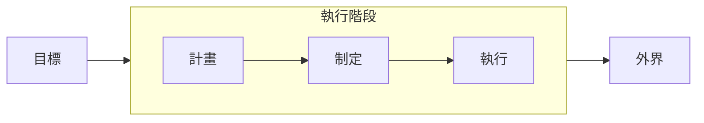
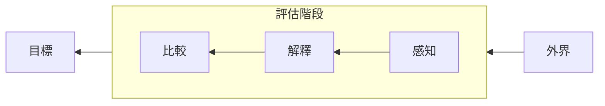
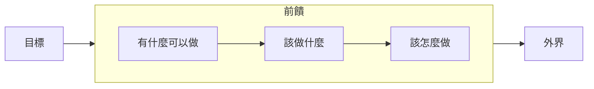
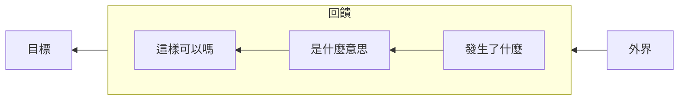
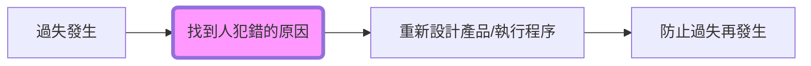
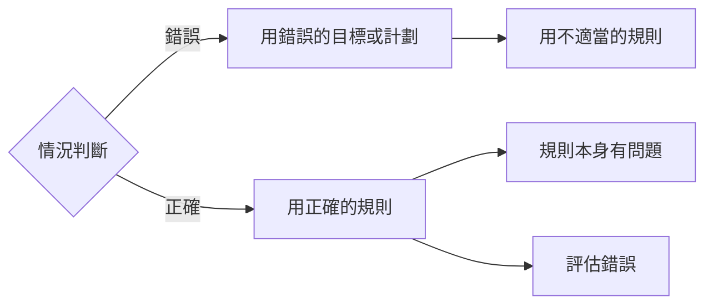
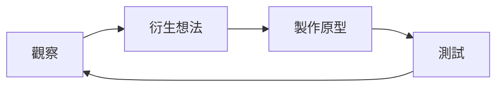
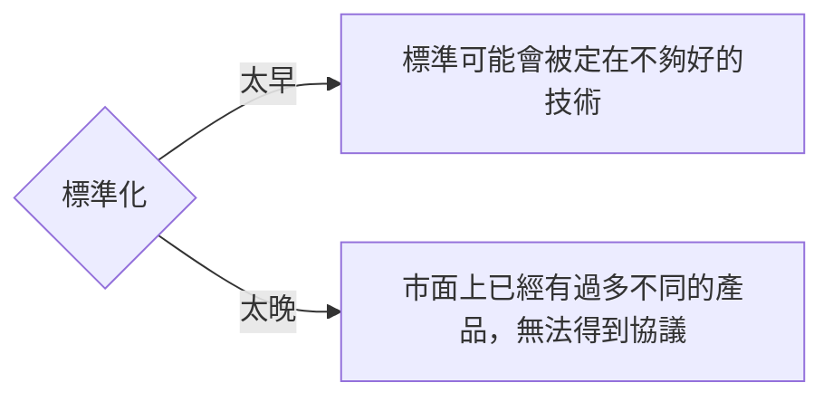

Title: [Book] 設計的心理學
Date: 2023-01-01 17:34
Category: Book
Tags: Design
Slug: the-design-of-everyday-things
Authors: Wei Lee

大四修了創意設計，就曾經看過這本書
當時就覺得這本書真的很有趣
探討了生活中的東西為什麼會這樣設計？
怎樣才是好的設計？
為什麼這是好的設計？那是壞的？
為什麼好的設計沒有成功？
人們又是怎麼去感知這些設計？

<!--more-->

最近因為 PyCon TW 志工內部的軟實力讀書會
終於又重新翻過這本書，原本只是想重新整理筆記
意外地花了 11.3 個小時閱讀（KOBO 是這麼說的）
還不包含整理這篇筆記的時間

軟實力讀書會的進行方式是有人會先快速 recap
接著大家開始討論在讀書會前就出好的問題
這一本我對我出的問題中最滿意的就莫過於第六章的

> 承 1, 2, 3 ，你怎麼知道這些問題是正確的問題

如果有興趣來交朋友、讀書的話，歡迎填寫 [PyCon TW 2023 志工報名表單](https://forms.gle/vLz3Xev8tUpnRqacA)
~~猝不及防的工商橋段~~

[TOC]

## Note
* 精確地陳述問題比解決問題重要得多
* 良好的設計比不好的設計更難察覺

### Ch 1 - 日常事務的精神病理學
* 優良設計的特點
    * 發現性（discoverability）
        * 使用者能簡單發現可以做什麼和如何做
    * 易理解性（understanding）
        * 產品該怎麼用
* **設計時必須假定人會犯錯**
    * 好的設計必須做到好的溝通，尤其是機器向人傳遞的訊息

#### 人本設計（human-centered design / HCD / 以人為中心的設計）
* 一般狀況外，設計*需要考慮出問題的情況*
    * 出錯時，產品要能用使用者能理解的方式指出問題，使其得以採取行動解決問題
* 可發現性來自 5 個基本心理觀念
    1. 預設用途 (affordances)
        * 物體和操作者之間的關係
        * 決定能採取的行動
    2. 指意(signifiers)
        * 提示行動該在哪裡發生
        * 有意的
            * e.g., 門上的「推」
        * 偶然的
            * e.g., 用雪地的足跡判斷路徑
    3. 使用局限（constraints）
    4. 對應性（mapping）
        * 分組（groupings）和接近性（proximity）
        * 相關的控制器應該被放在一起
        * 「自然」對應有時候是由特定文化所決定的
    5. 回饋（feedback）
        * 傳達一個動作的結果
        * 設計原則
            * 所有行動都需要回饋，但不能造成干擾
            * 回饋必須有優先順序
        * 太多的回饋有時候比太少的回饋更煩人

#### 概念模型（conceptual model）
* 東西如何運作的解釋
    * 提供預測事情會如何進行的理解方式，以及事情不如預期時，提供排除障礙的方法
* 推測概念模型的線索
    * 東西的結構
    * 指意
    * 預設用途
    * 使用局限
    * 對應性

#### 系統印象
* 人們在心中自然形成對自我、他人、環境，以及與他們互動的事物的心理模型

### Ch 2 - 日常行動的心理學

#### 採取行動的七個階段
* 執行的障礙： 要弄清楚這東西該怎麼用
* 評估的障礙： 了解發生了什麼事

#### 人類的認知與情感
* 本能層次
    * 簡單評估狀況，不分析原因
    * 受情緒性影響，而非情境和經驗
    * 蜥蜴腦
* 行為層次
    * 學習到的技能，在類似的情境下會被觸發
    * 知道自己在做什麼，但不知道細節
* 反思層次
    * 有自覺性的認知，思考、推理和有意識的決策發生的地方
        * 事件的歸因（attribution）和對未來事件的預期發生在這
        * 容易產生最持久的情緒

#### 怪錯了對象
* 回饋的時間點
    * 在使用者操作後的十分之一秒內提供回饋
    * 讓使用者預期的時間超過實際的操作時間，可以增加使用者的滿意程度
        * e.g., 視窗提示 10 分鐘下載完，最後只要 1 分鐘就完成
* *如果人們不能正確使用你的產品，該怎麼做？*
    * **不能怪罪使用者** → 將使用者遇到的困擾作為產品改進的指示
    * 移除錯誤訊息，用幫助性的指示取代
    * 協助使用者解決問題，並允許修正後繼續做原本的事，而不是從頭開始

#### 錯誤的自責
* 系統過失
    * 人為過失通常是設計不良的結果
    * 怪罪於人並不會解決失誤的根源，同樣的錯誤可能發生在別人身上

#### 七個行動階段：七項基本設計原則
* 設計師在設計產品時，必須要讓使用者能在任何時刻回答以下問題
    * 前饋（feedforward）
        * 助於理解要怎麼做
            * 透過指意、使用局限和對應性
    * 回饋（feedback）
        * 助於理解發生了什麼事

* **設計的基本原則**
    1. 可發現性
        * 讓使用者理解能做什麼操作和產品目前的狀態
    2. 回饋
        * 為操作後的結果和當前狀態，提供連續且完整的訊息
    3. 概念模型
        * 讓使用者理解產品，產生能掌握的感覺
    4. 預設用途
        * 適當的預設用途，讓必要的互動得以受注意
    5. 指意
        * 確保可發現性，及對回饋的良好表達和理解
    6. 對應性
        * 適當的空間佈局和時間配合來安排控制器和行動之間的關係
    7. 使用局限
        * 提供物理、邏輯、語義和文化性的使用局限來引導行動，減少多餘的解釋

### Ch 3 - 腦中的知識和外界的知識

#### 精確的行為和不精確的知識
* 為什麼不精確的知識可以導致正確的行為？
    1. 知識存在於腦中和外界
    2. 極高的精確度不是必要的
    3. 自然的使用局限
    4. 文化局限和約定俗成的習慣
* 陳述性知識（是什麼？）
    * 對事實和規則的知識
    * 寫出來，也容易教
* 程序性知識（怎麼做？）
    * 存在於行為層次的心理歷程
    * 難寫，難教
        * 最好的方式是示範教學和反覆練習

#### 記憶的結構
* 短期記憶 / 工作記憶
    * 目前正想到的、最新的經驗或資料
    * 檢索成本低
    * 保留資訊量低
        * 限制一般是五到七個項目
            * 如果透過「複誦」〔rehearsing〕，可以增加到十或十二個
    * 脆弱，一分心就會消失
* 長期記憶
    * 寫入時間長
        * 睡眠對於寫入每天的經驗可能是重要的
    * 檢索時間長
    * 記憶可能受到受到扭曲和改變
        * 如何回憶起經驗和知識，會影響這些資料怎麼被詮釋
    * 檢索是一個重建的過程，它也可能出錯
        * 重建的過程可能造成記憶變成我們希望的樣子，而不是真實的經歷
* 對無意義和有意義的東西的記憶
    * 無意義的記憶
        * 缺點
            * 學習困難
            * 難以除錯
        * 解決方案
            * 增添結構 → 好的概念模型
    * *設計應該提供使用者有意義的結構，並把訊息分佈在環境，避免使用到記憶*

#### 近似模型：在現實世界中的記憶
* 使用接近真實狀態的近似模型
    * e.g., `攝氏 = (華氏 - 30) * 2` (接近但不精確)

#### 腦中的知識
* 提醒：預期性記憶
    * 信號 → 知道做什麼
    * 訊息 → 知道怎麼做

#### 外界知識和腦內知識之間的比較
* 自然對應
    * 讓控制器和被控制的對象有明顯的對應關係
    * 對應方式的優劣排序
        * 最佳： 控制器直接安裝在被控制的對象上
        * 次佳： 控制器和被控制的對象盡可能接近
        * 不錯： 控制器和被控制的對象，依照相同的空間分配予以排列

#### 文化與設計：自然對應會隨文化而改變

### Ch 4 - 知道該做什麼：侷限、可發現性和回饋

#### 常見的局限
1. 物理（縮減行動的可能 → 讓可採取的行動變得明顯）
2. 文化
3. 意義
4. 邏輯

##### 以活動為中心的控制
* 以活動為中心的設計會讓人使用得更順手
    * **手動控制依然是必須的** ← 可能會出現意料之外的活動

#### 強制適當行為的局限
* 常見的做法
    * `強制性機能`： 前一個階段的操作沒成功無法觸發下一步
    * `互鎖`： 操作必須遵循正確的順序
    * `鎖入`： 防止有人過早或不小心停止正在進行的運作
    * `對外封鎖`： 防止有人進入危險的空間
* 過多的局限會讓人規避機能 → 權衡侷限的不便性和防止意外的安全價值

#### 使用聲音作為指意
* Pros
    * 容易吸引注意
* Cons
    * 太大聲容易惱人
    * 難以保密
* 必須更精準地被使用

### Ch 5 - 人為過失？錯了，是設計不良

#### 了解過失的原因

* 如果不能防止人犯錯，那它就不是個好設計

#### 兩種類型的過失：失誤和錯誤

##### 過失、失誤和錯誤的定義

* `過失`
    * `失誤（slips）`： 人打算做行動 A，卻做了行動 B，屬於低層次的行爲問題
        * `行動性`： 進行了錯誤的行動
        * `記憶性`： 記錯了、忘了，而導致動作沒完成
    * `錯誤（mistake）`： 訂了錯誤的目標或計劃，導致結果不正確，屬於高層次的認知問題，較難發現
        * `規則性`： 人遵循了錯誤的規則
        * `知識性`： 人知識不足或有誤
        * `記憶性`： 忘了目的或計劃

#### 失誤的各種分類
* 失誤時常於自於不專心 → 老手比新手更容易失誤

##### 擷取性失誤（capture slips）
* 經常做或最近才開始的行動突然取代應該要做的行動
* 如何避免？
    * 避免起始程序過於相似，而從中間開始分歧的程序設計
    * 越有經驗的人，越有可能犯擷取失誤
    * 行動的順序在一開始就要有所區別

##### 記述類似的失誤（description-similarity slips）
* 目標太過相似，導致心理上對目標的描述不夠清楚，而不是行動有誤
    * 目標越相似，越容易出現
* 如何避免？
    * 讓不同功能的控制器有明顯差異

##### 記憶缺失的失誤
* 通常因為干擾而發生，在決定行動和執行之間，被其他是其打斷，而中斷了行動
* 如何避免？
    * 減少步驟
    * 對尚未完成的步驟提供明顯的提醒
        * e.g., 強制性機能

##### 模式的失誤（mode-error slips）
* 模式： 當裝置有多種的狀態，而且相同的控制器在不同的情境下有不同的意義
    * 當功能越加越多，模式的失誤將變得難以避免
* 如何避免？
    * 避免使用模式
    * 明確地顯示當前的模式

#### 錯誤的各種分類
* 錯誤來自
    * 不正確的目標和計畫
    * 不正確地評估結果與目標

##### 基於規則的錯誤

* 基於規則的錯誤可能的發生原因

* 如何避免？
    * 提供使用者引導，用容易理解的方式顯示當前的狀態

##### 基於知識的錯誤
* 發生在還沒有足夠的知識或已知的規則能應付的陌生情況
* 如何解決？
    * 找到能幫助人們掌握狀況的概念模型

##### 記憶缺失的錯誤
* 常因為干擾而忘記當前狀態的評估
* 如何避免？
    * 持續提同相關資訊

#### 為人為過失而設計

* 警報設計是個困難的問題
    * 中斷和干擾容易導致為人過失
    * 必須足夠明顯到能吸引注意，但又不能讓人分心

##### 人為過失的研究裡學到的設計原則
* 局限
* 還原
* 確認訊息和錯誤訊息
    * 但人們常常忽略訊息繼續行動，怎麼辦？
        * 強調
            * 行動的目標
            * 行動本身
            * 行動的對象
            * 行動的影響
        * 使行動能被還原
* 合理性檢查
* 盡量減少失誤
    * 對行動及結果提供清楚的回饋，並且提供還原機制
    * 讓不同功能的控制差異化或遠離
    * 減少使用模式，或強調當前所在模式

##### 過失如何釀成事故的瑞士乳酪模型
* 一個優良設計的系統，通常要在各種故障和過失配合才會造成事故
    * **歸咎於單一原因是毫無意義的**
* 如何減少事故？
    * 多加幾片乳酪
    * 減少洞的數量
    * 讓洞的大小變小
    * 警告操作者，有幾個洞已經排成一列

#### 韌性工程
* 透過系統、程序、管理和人員訓練的設計，讓系統能應付突發狀況，並對其持續評估、測試和改善
    * e.g., 壓力測試

#### 自動化的矛盾
* 自動化讓人不必重複做繁瑣的事，但故障時，人們可能已經忘了該怎麼做

#### 處理過失的設計原則
* 先假設人是會犯錯的，並且用設計原則做出好的設計
    * 將操作所需之事放在外界，不要求人把所有知識記在腦中
    * 侷限
    * 執行時，提供前饋，讓行為的選項清楚
    * 評估時，提供回饋，讓行爲的結果顯而易見
    * 讓行動可還原 → 降低犯錯成本
    * 用人能理解的方式顯示系統的狀態

### Ch 6 - 設計思維
* **你怎麼知道你解決的是正確的問題？**

#### 解決正確的問題
* 拒絕直接動手的誘惑
* 設計思維（design thinking）
    1. 先試著找到根本的問題
    2. 問題找到後，開始考慮各種解決方案
    3. 決定一個提案，專注在上面

#### 雙菱形的設計模型
* 解決問題分為兩個階段，兩個階段依序各自會經過發散、收斂
    1. 找出正確的問題
    2. 找出正確的答案

#### 人本設計過程

* 觀察
    * 設計研究和市場調查
        * 行銷研究（要有人購買產品）
            * 傳統市場調查大多採用大規模的量化（quantitative）研究法
            * 關注顧客
                * 誰會購買？
                * 為什麼購買？
         * 設計研究（產品購買後要容易使用）
            * 傾向於質化（qualitative）
            * 深入研究使用者
* 衍生想法（idea generation / ideation）
    * 發想潛在的解決方案，常常被歸類為「腦力激盪」（brainstorming）
    * 常見的規則
        1. 產生越多的想法越好
        2. 不要自我設限
        3. 避免批評任何的想
            * 即使是明顯錯誤的想法中都有可能包含有用的見解
        4. 質疑一切
            * **「愚蠢」的問題在此時可能是最棒的問題 → 對理所當然的事提出質疑**
* 製作原型
    * 定義問題階段 → 了解問題
    * 問題解決階段 → 解決方案的原型
* 測試
* 重複漸進
    * 快速地設計和測試原型 → 失敗得早，失敗得快

#### 以活動為中心的設計，以人為中心的設計
* 產品必須支持一項活動以及所包含的各項任務
    * 好的設計會讓活動中的任務串連在一起並且不會互相干擾
* 活動： 一組朝著共同的高層次目標執行的任務
    * 任務： 一群組織完整的動作，指向一個低層次目標

#### 回到現實

> 諾曼的產品開發定律：一個產品開始開發的那一天，就已經落後進度、超過預算了

* 前期設計研究時常在執行上是困難的
    * 解決方案： 讓設計研究者持續地在使用的環境中觀察目標群體

#### 設計的挑戰
* 產品有許多相互矛盾的要求
* 為有特殊需要的人設計
    * 配合所有人的產品是困難，甚至不可能的 → 提供不同版本的同一產品
    * 「包容性設計」（inclusive design）、「通用設計」（universal design）
    * 烙印問題
        * 許多裝置可以幫助有特殊困難的人，但並沒有被廣泛使用，為什麼？
            * 大多數人不希望被提醒自己有缺陷的一面

#### 複雜是件好事，讓人混淆才是問題
* 複雜性是根本存在的，而不可取的是混亂
    * 複雜性（complexity）： 活動產生的多樣性
    * 繁雜（complicated）： 混亂的來源
* 提供好的概念模型是對付複雜性最重要的原則

#### 標準化與科技

* 標準化提供了易用性的重大突破

* 故意添加的困難
    * e.g, 安全系統
    * 即使在此情況，設計原則依然重要
        1. 這些困難是為了阻擋不該使用的人使用，但應該使用的人依然該易於使用
        2. 知道什麼是好的設計，才有辦法正確的反其道而行

### Ch 7 - 商業世界裡的設計

#### 功能沉迷症：一個致命的誘惑
* Why?
    * 現有顧客喜歡產品，且希望產品有更多功能
    * 競爭對手增加了新功能
    * 顧客滿意產品，但市場已飽和，只好用新功能吸引顧客更新

#### 推出一項新產品，需要多久？
* 經驗法則來說，一個想法在實驗室成形後 20 年才會商業化， 再 10 ~ 20 年才會廣泛採用

#### 兩種創新的形式：漸進和激進
* 漸進的創新
    * 產品不斷重複測試和重新修改
    * 最常見、最有力的創新形式
* 激進的創新
    * 科技的重新定義

#### 設計的心理學：從1988年到2038年
* 分布式認知（distributed cognition）
    * 一件事情的某些部分由人（可以是分布在不同時間和空間的人）來做，其他部分則由科技來做

#### 設計的道德義務
* 不必要的功能、改版，對環保是不利的
    * 可能的永續法 → 訂閱模式

##### 設計思維與對設計的思考
* 小而美的崛起
