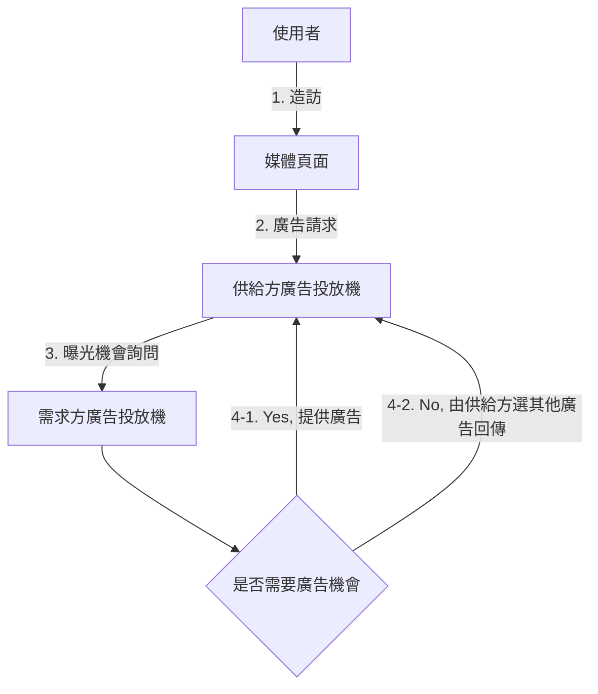
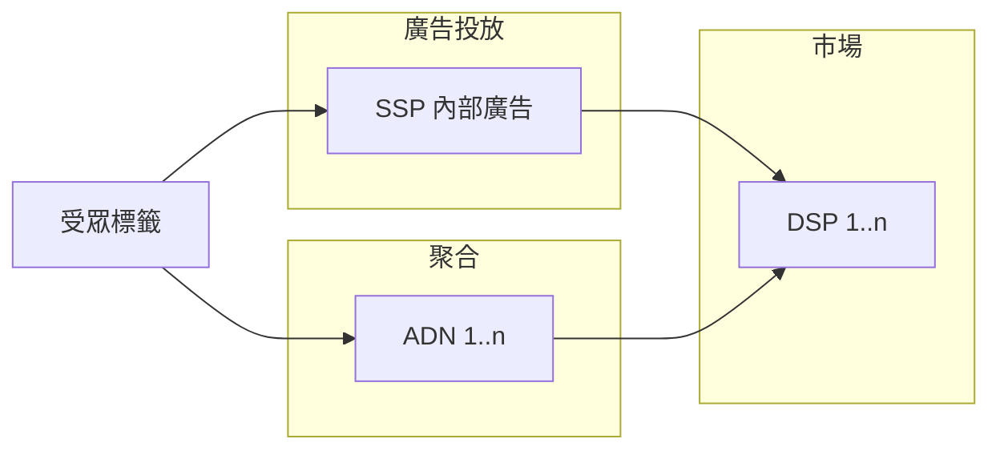
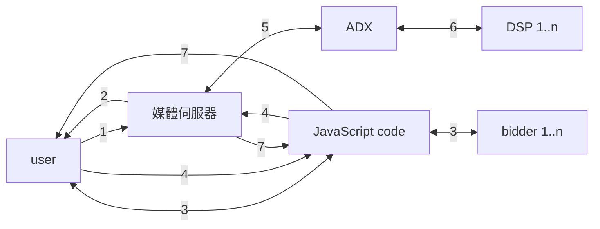

Title: [Book] 計算廣告：互聯網商業變現的市場與技術
Date: 2026-06-27 16:00 +0800
Category: Book
Tags: Advertising
Slug: computational-advertising
Authors: Wei Lee
Lang: zh-tw
Status: draft

因為原文就是簡體的，所以整個筆記會有中國用語
我用 [opencc-python](https://github.com/yichen0831/opencc-python) 簡轉繁

<!--more-->

[TOC]

## Note

### 常見名詞
* 千次曝光付費（Cost per Mille，CPM)
* 千次曝光期望收入（expected Cost per Mille, eCPM）
* 點擊付費（Cost per Click，CPC）
* 千次曝光收益（Revenue per Mille，RPM）
* 點擊率（Click Through Rate，CTR）： 廣告點擊與廣告展現的比率
* 轉化率（Conversion Rate，CVR）： 轉化次數與到達次數的比例
    * 轉化： 使用者從 landing page 開始，進一步完成下單等操作
* 客戶關係管理（CRM, Customer Relation Management）
* 資料管理平台（DMP, Data Management Platform）

### 前言
* If you can't measure it, you can't manage it.

### Ch 1 線上廣告概述

#### 免費模式
* 免費模式： 將能規模化、客製化傳播資訊的商品，以邊際成本的價格出售
    * 狹義案例： 軟體產品不收費（多一個使用者的邊際成本很小）
    * 廣義案例： 硬體以毛利為零左右的價格出售（邊際成本 = 量產成本）
* 變現核心資產
    1. 流量
        * e.g., 有人使用你的產品時，你在產品夾帶付費內容（sponsored content）
    2. 資料
    3. 影響力
        * e.g., 近年來迅速崛起的網紅和自媒體

#### 廣告的目的
* 為什麼需要廣告？
    * 透過媒體達到低成本的使用者接觸（"低成本"是與市場或銷售人員的成本相對而言的）
* 廣告分類
    * 品牌廣告（brand awareness）
        * 快速接觸大量使用者，宣傳品牌形象，提升中長期購買率
        * 傳統廣告的主要目的之一
    * 直接效果廣告（direct response）
        * 利用廣告馬上帶來大量的購買或其他轉化行為

#### 廣告形式
01. 橫幅廣告（banner ad）
02. 文字廣告（textual ad）
    * 提供連到廣告主 landing page 的連結
    * 搜尋廣告的主流形式
03. 富媒體廣告（rich media ad）
    * e.g., 彈跳視窗
    * 適合在高品質的媒體做品牌廣告投放，對使用者的使用體驗影響較大
04. 影片廣告（video ad）
05. 互動式廣告（playable ad）
06. 社交廣告（social ad）
    * 在社交網路中嵌入的廣告
07. 行動廣告（mobile ad）
    * 嚴格來說與桌面廣告沒有本質的區別
08. 郵件營銷廣告（Email Direct Marketing，EDM）
    * 非常容易變成垃圾郵件的主要來源
    * 需要精準地把握使用者興趣，有節制地提供相關資訊
09. 激勵廣告（incentive ad）
    * e.g., 平台提供折扣或積分
    * 優點： 提高轉化效率
    * 缺點
        * 使用者對產品的需求並不強，因此後續效果會快速降低
        * 取得新客戶的忠誠度較差
10. 團購
11. 遊戲聯運
    * 根據使用者最終遊戲內消費在推廣管道和遊戲開發商之間分成的商業產品
12. 固定位導航
    * e.g., 入口網站的付費廣告

#### 線上廣告的歷史
* 擔保式投送（Guaranteed Delivery，GD）
    * 主要客戶： 品牌廣告主
    * 收費方式： CPM
    * 核心概念： 保證滿足各合約目標量的同時，儘可能為廣告主分配到效果更好的流量
    * 挑戰
        1. 如何將流量分配到各個合約重疊的受眾上
        2. 如何在線上即時決定要曝光的廣告
* 競價廣告（auction-based advertising）
    * 供給方只保證單位流量的成本
* 廣告網路（AD Network，ADN）
    * 按人群或上下文標籤賣廣告給需求方，用競價的方式分配流量
    * 收費方式： CPC
* 即時競價（Real Time Bidding，RTB）
    * 需求方按自己的人群定義來挑選流量

### Ch 2 計算廣告基礎
* 廣告產品能最佳化的主要是**收入**
    * **eCPM** 是計算廣告中最核心的量化指標之一

#### 廣告有效性原理及其最佳化的方式
1. 曝光階段
    * 有效程度與廣告位的物理屬性有關，沒有太多最佳化的空間
2. 關注階段
    * 明確傳達向使用者推送此廣告的原因
3. 理解階段
    * 集中強調一個主要訴求以吸引使用者的注意力
4. 接受階段
    * 廣告安全（ad safety）： 如何讓合適的廣告出現在合適的媒體上
5. 保持階段
6. 決策階段

越前面的階段對 CTR 影響越大，越後面對 CVR 影響越大

#### 廣告計費模式
* 常見的模式
    1. CPT（Cost per Time）
        * 有額外的品牌效果和櫥窗效應，但不利於受眾定位和自動化交易
    2. CPM（Cost per Mille）
    3. CPC（Cost per Click）
    4. CPS（Cost per Sale）/ CPA（Cost per Action）/ ROI
        * 即按照銷售訂單、轉化行為或投入產出比來結算
    5. oCPM（optimized CPM）
        * Facebook主推的一種新結算方式
        * 仍照 CPM 結算，但會根據轉化率進行最佳化→ 平台方會承擔點擊率和點擊價值估計的任務
* 使用時機
    * 效果廣告： CPC
    * 品牌廣告： CPM
    * CPS / CPA / ROI 在特定的環境下才會使用
    * oCPM 則是資料能力較強的廣告平臺走向 CPA 的過渡

### Ch 3 線上廣告產品概覽
* 常見廣告產品的分層
    1. 廣告計劃 (campaign)
        * 廣告主的一次投放合約，包括預算、時間範圍等基本資訊
    2. 廣告組 (ad group)
        * 具體的廣告投放策略
        * 主要是設定**受眾定向條件**和出價 → 廣告效果最佳化的關鍵層級
    3. 廣告創意 (creative)
        * 最終曝光出來的素材

### Ch 4 合約位廣告
* 決定使用定向方法的考量點
    1. 效果： 流量是否高出平均效果的水準
    2. 規模： 流量佔整體廣告庫存流量的比例

#### 受眾定向方法概覽
1. 地域定向（geo-targeting）
2. 人口屬性定向（demographical targeting）
    * e.g., 年齡、性別、教育程度、收入
3. 上下文定向（contextual targeting）
    * e.g., 關鍵詞、主題、廣告主的分類
    * 覆蓋率比較高
4. 行為定向（behavioral targeting）
    * e.g., 使用者的歷史瀏覽行為
5. 精確位置定向（hyper-local targeting）
    * 在行動裝置上投放廣告時，可能獲得精準的地理位置
    * 適合區域性非常強的小廣告主（e.g., 餐飲、美容）
6. 重定向（retargeting）
    * 對廣告主過去一段時間內的訪客投放廣告以提升效果
    * 精準程度最高、效果最突出，但人群覆蓋量較小
7. 新客推薦定向（look-alike targeting）
    * 基於廣告主過往的訪客，基於平台的標籤找出行為類似的潛在客戶
    * 目的是在同等使用者覆蓋率的情況下，達到比通用的興趣標籤更好的效果
8. 動態定價（dynamic pricing）
    * e.g, 團購（隨著一起購買的人數改變價錢）
9. 場景定向（scenario targeting）

#### 受眾定向標籤體系
* 標籤體系
    1. 層級標籤體系（結構化）
        * 上層的標籤是下一層的父節點
    2. 興趣標籤體系（非結構化）
        * 所有的標籤不在同個分類，沒有明確的父子節點關係
* gotcha
    * 隨著標籤數量的增加，每個節點的流量會迅速收縮
        * 當節點流量過小時，對其進行預測就變得相當困難
    * 廣告產品聲稱自己的標籤體系複雜是沒有意義的，標籤背後的人群規模才有價值

#### 流量預測
*  流量預測的個主要用途
    1. 售前指導
    2. 線上流量分配
        * 一次曝光同時滿足兩個以上合約的要求時，怎樣決策將它分配給哪個合約以達到整體滿足所有合約的
    3. 出價指導
        * 在競價廣告中，由於沒有了量的保證，廣告主往往需要根據自己預計的出價先了解一下可能獲得多少流量，以判斷自己的出價是否合理

### Ch 5 搜尋廣告與競價廣告

* 廣告網路中的競價標的
    1. 上下文頁面中的**關鍵詞**，從搜尋廣告衍生
    2. 根據使用者行為加工**興趣標籤**，從曝光廣告的定向邏輯衍生

#### 搜尋廣告
* 產品形態
    * 競價標的： 競價關鍵詞（bid term）
        * 使用者輸入的查詢（query）透過與關鍵詞匹配，來確定是否可以觸發該條廣告
    * 結算方式：  CPC
    * 曝光區一般分為北、東、南3個部分，其中南區較為少用
        * 
* 產品策略
    * 查詢擴充： 為廣告主自動擴展相關的查詢詞，擴大匹配流量
        * 精確匹配
        * 短語匹配： 當查詢完全包含廣告主關鍵詞或關鍵詞（包括關鍵詞的同義詞）的集合時
        * 廣泛匹配： 當查詢詞與關鍵詞高度相關時
            * e.g., 英語培訓 → 外語學習班、四級證書
        * 否定匹配： 明確指出哪些詞是不能被匹配的
    * 檢索
    * 排序
        * 將候選廣告根據eCPM排序
    * 放置
        * 考量因素
            1. 廣告相關性 → 確保使用者體驗
            2. 廣告的RPM → 有效利用曝光位置
    * 定價
* 產品案例： Google AdWords

#### 位置拍賣與機制設計

* 市場保留價（Market Reserve Price，MRP）
    * a.k.a. 起價, 底價
    * 贏得拍賣位置的最低價格，用以控制廣告的品質和保持一定的出售單價
* 定價策略
    * 廣義第二高價（GSP）
        * 對每一個贏得位置的廣告主，都按照他下一位的廣告主出價來收取費用
        * 競價廣告系統的主流定價策略
            * 不是最佳策略，但最容易實作、解釋
    * VCG 定價
        * 贏得了某個位置的廣告主，其所付出的成本應該等於他佔據這個位置給其他市場參與者帶來的價值損害
        * 邏輯過於複雜，比較難以向廣告主解釋清楚，「給其他市場參與者帶來的價值損害」也很難驗證
* Myerson 最佳拍賣
    * 對於期望收益很可能比較高的大玩家，會透過虛擬出價的變換對其進行一定程度的懲罰，以刺激其出更高的價格
    * 實作上大多平台都會採用部分的概念（e.g., 對出價能力強的買家進行一定程度的價格歧視），但不會公開宣稱

#### 競價廣告網路
* 批次聚合各媒體的剩餘流量，按照人群或上下文標籤的流量切割方式售賣給廣告主
    * 對媒體而言，只需要在廣告位的剩餘流量上呼叫廣告網路的投放程式碼或SDK，而不用關心每次曝光的投放結果
* 主流計價方式： CPC
* 關鍵的產品特點
    1. 不向廣告主做量的約定，而是根據 eCPM 來決定每次曝光分配給哪個廣告主
    2. 極力淡化媒體和廣告位的概念，很難拿到品牌溢價高的廣告位，一般不適合品牌廣告
    3. 由於廣告網路根據實際消耗來結算，通常要求廣告主先儲值，因而改善平台方的財務
* 產品案例： Google Display Network

#### 競價廣告需求方產品 → SEM
* 透過競價採買搜尋引擎關鍵詞來做推廣
* 進行關鍵詞選擇的目的是提高廣告主採買流量的ROI
    * compare to 搜尋引擎進行查詢擴充套件的目的是為了提高自己的營收
* 服務對象通常是中型以上的廣告主
* 產品案例： Efficient Frontier
    * 透過關鍵詞選擇和出價，為搜尋廣告主提供大量關鍵詞情形下的ROI 最佳化
    * 透過計算的方法確定一個投資組合中各個品種的投資比例，以達到期望收益最佳情況下風險最小的理論。在各個投資期望收益水平下，相應的最小組合風險對應的曲線就稱為efficient frontier。

### Ch 6 程式化交易廣告

#### 即時競價
* 客製化使用者標籤（customized audience segmentation）: 在做人群選擇時，需要利用廣告主自有的資料 ← **即時競價的關鍵產品目標**

* 流程
    1. 使用者標識映射（cookie 映射）
        1. 從`廣告主網站`向 `DSP 伺服器` 發起 cookie 映射請求
        2. `DSP` 與 `ADX 伺服器`之間通訊完成 cookie 映射
    2. 廣告請求（ad call）
        1. 當`使用者`接觸到`媒體網站`的廣告位時，前端向 `ADX` 發起廣告請求
        2. `ADX` 向各 `DSP` 傳送 URL（或應用 ID ）和使用者標識，發起詢價請求
        3. `媒體網站` 從勝出的 `DSP` 拿到廣告創意並展示

```mermaid
flowchart LR
    User --2.1-->Media
    Media --2.2--> ADX
    ADX <--2.3--> DSP
    Ad -.1.1.-> DSP
    DSP <-.1.2.-> ADX

    User[使用者]
    Media[媒體網站]
    Ad[廣告主]
    DSP[DSP 1..n]
    ADX[ADX]
```

* [IAB](https://www.iab.com/) 制定了 [OpenRTB](https://openrtb.github.io/OpenRTB/) 介面標準，已經被一些 ADX 採用

#### 優選（Preferred Deal，PD）
* 步驟
    1. `使用者`造訪`媒體頁面`
    2. `媒體頁面`透過 JavaScript 程式碼或 SDK 向`供給方廣告投放機`發起廣告請求
    3. `供給方廣告投放機`向`需求方廣告投放機`發起詢問是否需要此次廣告曝光機會
    4. `需求方廣告投放機`判斷是否需要此次曝光
        1. 需要，則返回相應的廣告創意
        2. 不需要曝光機會，則通知`媒體廣告投放機`，由`供給方廣告投放機`從自有廣告庫中選擇合適的創意返回



* 計價方式: CPM
    * 沒有多方競價，又有選擇流量的便利，因此比一般比市場 CPM 單價更高
    * 決策過程可能存在比較多的投放機往返

#### 私有市場
* 邀請制的交易方式
    * 廣告主的品質可以較好地控制（優選的好處）
    * 被邀請的各需求方間仍需競價，有利於提升媒體的變現能力（競價的好處）
* 以 DoubleClick ADX、Mopub 等為代表的主流 ADX 都在大力加強私有市場的產品和服務

#### 程式化直投 (PDB)
* 直接購買與即時競價的過渡
    * 定價、保量或半保量
    * 需求方可以對採買的庫存做廣告投放決策
    * 有時可進行一定的流量選擇
* 特點
    1. 跨媒體頻率控制
    2. 多個子產品流量分配 → 提高流量使用價值
        * 需求方可以根據自有 CRM (Customer Relation Management)、DMP (Data Management Platform) 以及策略在子產品之分配流量 → 相當於一個內部的 ADN
    3. 一定比例的還量
        * 部分媒體向 DSP 提供了一定比例的還量自由（例如可以返還20%的廣告請求）
            * 頻率過高或人群不匹配時，DSP 可以決定不投放廣告

#### 廣告交易平臺 (ADX)
* 計價方式： CPM
* 產品案例： DoubleClick ADX

#### 需求方平臺 (DSP)
* 產品核心特徵
    1. 程式化的流量購買方式（e.g., RTB, 優選）
    2. 供需求方進行客製化使用者劃分
* 產品策略
    * 檢索、排序、定價、**出價**
        * 出價直接決定 DSP 的流量基本單位成本和利潤
        * 出價策略（主要看 eCPM 和市價隨時間變化的曲線）
            1. 透過歷史資料，得到 eCPM 和市價的曲線
            2. 將一天的預算分配到 $eCPM \over 市價$ 較大的流量
* 重定向
    * 對曾經對廣告主服務感興趣的使用者找出來，再對他們投放
    * 召回重定向與個人化重定向
        * 網站重定向（site retargeting）： 將一段時間內到達過廣告主服務的使用者作為重定向集合
        * 個人化重定向（personalized retargeting）： 對重定向流量進行個人化加工
            * 對處於不同購買階段（e.g., 瀏覽、搜索、加入購物）的使用者，採用合適的創意推動他儘快完成轉化行為
            * 對有過購買記錄的使用者推薦相關的商品以提升二次購買率
                * 動態創意
                * 推薦引擎
                * 廣告主商品庫存即時介面
                    * 避免使用者點擊廣告後發現售完
        * 搜索重定向： 將搜索過與廣告主直接相關的關鍵詞的使用者群作為重定向集合
* 新客推薦（look-alike）
    * 由廣告主根據自己的第一方資料提供一部分種子使用者，再由第二方資料的廣告平臺分析這些使用者網路行為的特徵，並根據這些特徵找到具有相似特徵的擴展人群

#### 供給方平臺 （SSP）
* 產品策略
    1. 聚合（mediation）： 集成多個 ADN 的 JavaScript 程式碼或 SDK，動態決定向誰請求廣告
    2. 廣告投放（ad serving）
    3. 市場（marketplace）： 程式化交易產生後，SSP也會以RTB方式向DSP請求廣告，形成了一個市場



* 決策過程
    1. 估算出被聚合的 ADN 和內部廣告的 eCPM
    2. 用排序出最好的價格作為底價向 DSP 詢價
    3. 若排序最高的 ADN 拒絕請求，則向後面的排名發出請求 → 可能造成延遲 ← Header Bidding 就是要解決這個問題
* Header Bidding
    * Bidder 繞過 ADX 直接向媒體報價，媒體根據出價高低決定中標者，如果沒有，再交由 ADX 進行即時競標
        * Bidder： 所有可以進行報價的服務（e.g., DSP、 ADX、其他廣告參與者）
    * 主要區別
        * 繞過 ADX 接可回傳報價的 DSP 而非只能估計 eCPM 的 ADN
            * 收入最佳化變簡單
            * 容易獲得更高的 eCPM
        * 缺點
            * 廣告延遲
                * 實際曝光減少
                * 影響使用者體驗
    * 過程
        1. `使用者`造訪`媒體頁面`
        2. `媒體`將 Header Bidding 的 script hb.js 放在 HTML 的 head 中發給`使用者瀏覽器`
        3. 透過 hb.js，`使用者瀏覽器`向媒體網站約定好的 `Bidder` 發起曝光機會的競價請求，`Bidder`將報價回傳給`使用者瀏覽器`
        4. 透過 hb.js，`使用者瀏覽器`將 `Bidder` 報價回傳給`媒體網站`
        5. `媒體`同時向 `ADX` 或 `SSP` 發廣告請求
        6. `ADX` 或 `SSP` 發起 RTB 過程並獲得廣告候選
        7. `媒體`將 Header Bidding 出價結果和RTB出價結果排序，出價最高者贏得本次廣告展示機會，`使用者瀏覽器`請求勝方廣告



### Ch 7 資料加工與交易

#### 有價值的資料來源
1. 使用者標識
    * 瀏覽器行為最常用 cookie，但長期一致性不佳
        * 好在廣告關鍵看的是使用者近期內的行為
        * 若同網域另有永久身份服務（e.g., email、SNS），可用此身份找回過期或被清除的 cookie → 改善身份一致性
    * App 內廣告的使用者 ID
        * iOS： IDFA（IDentifier For Advertising），性質類似 cookie
        * Android： 無專用廣告 ID，多採 Android ID 或 IMEI（International Mobile Equipment Identity）
2. 使用者行為
    * 可廣泛採集且對受眾定向 / 廣告決策有用的線上行為： 轉化（conversion）、預轉化（pre-conversion）、搜尋廣告點擊（sponsored search click）、展示廣告點擊（ad click）、搜尋點擊（search click）、搜尋（search）、分享（share）、頁面瀏覽（page view）、廣告瀏覽（ad view）
    * 依主動程度分類
        * 決策行為： 轉化、預轉化 → 發生在廣告主網站內，對應非常明確的使用者興趣
        * 主動行為： 廣告點擊、搜尋、搜尋點擊 → 明確意圖下主動產生，資訊量豐富
        * 半主動行為： 分享、網頁瀏覽 → 興趣領域有價值但內容精準度有限；但資料量是各類行為中最大的
        * 被動行為： 廣告瀏覽 → 嚴格來說不能算定向依據
3. 人口屬性
4. 地理位置
* gotcha： 廣告根本目的是「低成本接觸潛在使用者」。越靠近轉化的行為雖越精準，但那群人已接近決策最終階段、越不算「潛在使用者」→ 行為定向不能單純追求 ROI 或轉化效果

#### 資料管理平台（DMP）
* 第一方 / 第二方： 分別指廣告主與廣告平台；不直接參與交易的其他資料提供方統稱第三方
* 第三方 DMP（又稱資料交易平台，data exchange）
    * 主要功能： 聚合各來源的線上使用者行為資料，加工成有價值的使用者標籤，在廣告市場售賣變現
    * 交易一般透過 ADX 或 SSP 中轉，好處：
        1. 降低傳輸成本： 在廣告請求上附加標籤不會帶來額外開銷，整體只剩 DMP↔ADX 一次傳輸（DMP↔DSP 直接交易成本太高）
        2. 拓撲簡單： 所有 DSP、資料提供方只需與 ADX 做 cookie 映射（以 ADX 為中心的星形拓撲），比 DSP 各自對接資料提供方方便得多
        3. 支援部分交易： DSP 很少用到某 DMP 的全部資料，透過交易過程傳資料可自由限制範圍
        4. ADX 在買賣方間恰好擔任資料用量監測與計費的角色

#### 隱私保護與資料安全
* 隱私保護基本原則
    1. 嚴格避免使用個人可辨識資訊（PII, Personal Identifiable Information）
        * e.g., 身份證號、電話、email、住址 → 一旦被惡意取得風險極大，須無條件嚴格保護
        * cookie、IMEI 等使用者標識不易辨識到具體個人，不屬於 PII
    2. 使用者有權要求系統停止追蹤與使用自己的行為資料
    3. 不應長期保留與使用使用者行為資料
    4. 工程上注意權限嚴格分配與最小資料存取原則
* 準識別碼與 K 匿名
    * 將準識別碼做泛化（e.g., 「年齡 36 歲」→「30～40 歲」、「上海市攜程大廈」→「上海市」）
    * 若泛化後資料集裡每組準識別碼實例都能找到 K 條相同的 → 實現 K 匿名
* 稀疏行為資料的挑戰
    * 稀疏行為資料帶來的隱私風險尚無成熟解法
    * 差分隱私（differential privacy）： 對資料集做一定程度修改，在儘量少損失查詢準確率下使隱私洩露風險最低
* 程式化交易中的資料安全
    * 供給方： 惡意 DSP 可能對所有可競價請求都以低價參與，目的不在贏流量而在收集媒體上的使用者行為 → 受頻寬限制，ADX 應儘量只向最可能贏的 DSP 詢價，把惡意收集者擋在多數詢價之外
    * 需求方： 市場對此的重視與解法都還不足 → 廣告主用自有第一方資料時（尤其面對強勢平台）要特別留意資料安全
* 歐盟 GDPR 認為消費者應明確擁有的 4 項個人資料權利
    1. 資料存取權
    2. 被遺忘權
    3. 限制處理權
    4. 資料攜帶權

### Ch 8 News Feed 與原生廣告

#### 行動廣告的現狀與挑戰
* 行動廣告的特點
    1. 場景廣告的可能性： 行動裝置一直跟著使用者，可全天候監測分析行為，從地理位置、生活狀態、需求意圖等各方面深入理解使用者（與 PC 最大的不同）
    2. 大量潛在的本地化廣告主： 過往沒有任何主流管道能幫本地化小商家做推廣
* 傳統創意形式
    1. 橫幅與插屏（interstitial ad）
    2. 開屏與鎖屏
    3. 推薦牆與積分牆
* 挑戰
    1. 應用生態造成行為資料割裂： App 間相對獨立，沒有 Web 超連結那樣的組織體系，資料來源割裂、難整合
    2. 許多 PC 時代廣告主行動化程度不足，無法充分消化廣告帶來的流量

#### 資訊流廣告（feed ad）
* 起源於社交網路；2010/04 Twitter 發布「Promoted Tweets」，在資訊流中插入商業化內容
* 定義
    1. 廣告以與內容聯動的方式互動
    2. 被廣告區隔開的各部分內容之間沒有直接關聯
* 是展示廣告的特例，主體決策流程與展示廣告基本一致；特有問題有兩點
    1. 廣告位適配： 如何把同一廣告素材適配到不同的資訊流位置
    2. 廣告競價與放置： 插入位置取決於兩個參數
        * S： 首條廣告出現在第幾條內容之後
        * K： 兩條廣告之間間隔幾條內容
        * S、K 越大 → 使用者關注越少、對體驗影響越小
        * 最佳化目標： 在平均廣告條數（≈ 對使用者體驗的約束）的約束下，調整每位使用者的 S 與 K，最佳化總體點擊率

#### 其他原生廣告相關產品
* 搜尋廣告與內容的混合方式
    1. 廣告固定位置展現
    2. 廣告與內容混排
    * 實際搜尋引擎中，廣告（按 eCPM 排序）與內容（按相關性排序）來源不同，混合規則是固定邏輯，並未按同一準則統一排序
* 軟文廣告
    * 高品質軟文讓讀者像接受普通文章一樣接受內容，宣傳效果好
    * 但生產與傳播難標準化、非產品化交易對象 → 不是重點討論的廣告產品

#### 原生廣告平台
* 兩種「原生」訴求
    1. 表現原生： 廣告展示風格、樣式與內容一致（產品形式上的原生）
    2. 場景原生： 廣告投放決策邏輯與內容生產一致（使用者場景上的原生）
    * 場景原生需要媒體明確提供場景與需求；進一步比較搜尋廣告與社交資訊流廣告，前者效果仍優於後者
* 植入式原生廣告的兩件事
    1. 判斷使用者當前的場景與意圖
    2. 依意圖決定提供什麼樣的資訊
* 案例： FAN（Facebook Audience Network）
    * eCPM 一般高於其他 ADN
    * 對媒體廣告位有分級評定制度，不同級別以不同品質的廣告填充，eCPM 差距可達一個數量級
    * 與多數變現產品不同，迄今未引入任何程式化交易成分： 既不向 DSP 開放 RTB 介面，也不從其他 ADX 購買流量

### Ch 9 計算廣告系統架構

#### 個人化系統的 4 個主體
1. 線上投放引擎（online serving engine）： 即時回應請求、完成決策
2. 離線分散式計算（distributed computing）資料處理平台
3. 線上流計算（stream computing）平台： 用於線上即時回饋
4. 資料高速公路（data highway）： 連接與轉運上述三部分的資料流
* 資料流程
    * 線上投放系統日誌 → 資料高速公路 → 快速轉運至離線資料處理平台與線上流計算平台
    * 離線平台週期性以批次處理過去一段時間的資料 → 人群標籤與其他模型參數 → 存快取供線上決策
    * 線上流計算平台處理最近一小段時間的資料 → 準即時的使用者標籤與參數 → 存快取，作為離線結果的即時補充與調整

#### 線上投放系統
1. 廣告投放機（ad server）： 接收前端 Web 伺服器請求、完成投放決策並回傳頁面片段的主邏輯
    * 最重要指標： QPS（Query per Second）與廣告決策延遲（latency）
2. 廣告檢索（ad retrieval）： 依使用者標籤（user attribute）與頁面標籤（page attribute）從廣告索引（ad index）查找符合條件的候選
3. 廣告排序（ad ranking）： 線上高效計算廣告 eCPM 並排序
4. 收益管理（yield management）
5. 廣告請求介面： 可能來自 HTTP Web 伺服器、行動 App 內 SDK 或其他類型 API
6. 客製化使用者劃分（customized audience segmentation）

#### 資料高速公路
* 將線上投放資料準即時傳輸到離線分散式計算平台與流式計算平台，供後續處理與建模使用

#### 離線資料處理
* 兩個輸出目標
    1. 統計日誌 → 報表、儀表板等，供人決策時參考
    2. 資料探勘 / 機器學習 → 受眾定向、點擊率預估、分配策略規劃等，支援線上的機器決策
* 主要模組
    1. 使用者會話日誌（session log）生成： 把各管道收集的日誌整理成以使用者 ID 為鍵的統一儲存格式
    2. 行為定向
    3. 上下文定向
    4. 點擊率建模： 在分散式平台上訓練得到點擊率的模型參數與特徵，載入快取供線上決策使用
    5. 分配規劃： 依廣告系統全域最佳化需求，用離線日誌規劃出適合線上執行的分配方案（allocation plan），服務線上收益管理模組
    6. 商業智慧系統： 含 ETL（extract-transform-load）、儀表板、Cube → 以人為最終介面的資料處理分析總括，擔負對外資訊交流；營運者依資料回饋及時調整系統設定
    7. 廣告管理系統： 廣告操作者即客戶執行（AE, Account Execute）與廣告系統的介面；AE 用以定制 / 調整投放並與資料倉庫互動取得統計資料以支援決策 → 一般廣告系統中只有這部分面向使用者

#### 線上資料處理
1. 線上反作弊： 即時識別作弊流量
2. 計費
3. 線上行為回饋
4. 即時索引

#### 計算廣告系統主要技術
1. 特徵提取（式 2.2）： 對 a, u, c 打標籤以利後續建模與市場售賣 → 計算廣告中非常核心的受眾定向問題
2. eCPM 估計（尤其點擊率預測，參見 14.1 節）→ 不考慮全域最優時，完成每次展示的局部最佳化
3. 線上分配： 考量量的約束與投放即時決策的要求時產生
4. 機制設計（mechanism design）： 為在多方博弈市場達到動態平衡時的收益最大化
5. 探索與利用（E&E, Explore and Exploit，參見 14.3 節）： 強化學習（reinforcement learning）技術，更全面取樣整個 (a, u, c) 空間以更準確估計點擊率
6. 個人化推薦（personalized recommendation，參見 15.2 節）： 即時競價時代廣泛用於效果類 DSP 的個人化重定向
