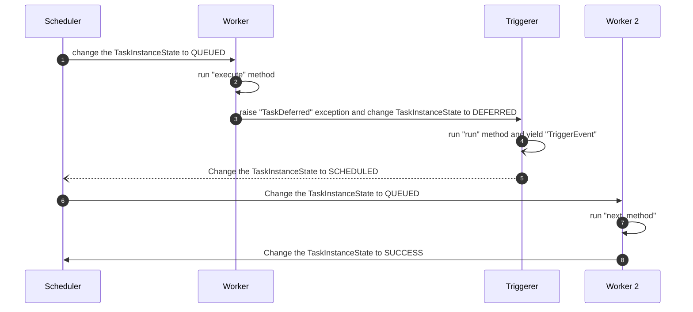

Title: Serialize StartTriggerArgs
Subtitle: That's not how Airflow serialization works!
Date: 2024-08-18 10:30
Category: Tech
Tags: Python, Airflow, Airflow 2.10
Slug: serialize-start-trigger-args
Authors: Wei Lee
Series: What If...? Running Airflow Tasks without the workers
Cover: /images/posts-image/2024-serialize-start-trigger-args/han.jpg

This article discusses the implementation details of `StartTriggerArgs`, which may not interest most Airflow users. However, if you're a contributor or simply interested in how Airflow works, let's dive in.

<!--more-->

I'll focus on PR [ Enhance start_trigger_args serialization #40993 ](https://github.com/apache/airflow/pull/40993), which fixed an issue in [ Prevent start trigger initialization in scheduler #39585 ](https://github.com/apache/airflow/pull/39585).

## What's the issue?

Following the same example as the [previous article]({filename}/posts/tech/2024/13-enhancing-airflow-task-execution-with-start-trigger-args.md)

```python
from airflow.sensors.date_time import DateTimeSensorAsync
from airflow.triggers.base import StartTriggerArgs


class ExecuteFromTriggerDateTimeSensor(DateTimeSensor):
    start_trigger_args: StartTriggerArgs = StartTriggerArgs(
        trigger_cls="airflow.triggers.temporal.DateTimeTrigger",
        trigger_kwargs={"moment": "", "end_from_trigger": False},
        next_method="execute_complete",
        next_kwargs=None,
        timeout=None,
    )
    start_from_trigger: bool = True

    def __init__(self, *, trigger_kwargs, **kwargs) -> None:
        super().__init__(**kwargs)

        self.start_trigger_args.trigger_kwargs = dict(
            moment=timezone.parse(self.target_time),
            end_from_trigger=self.end_from_trigger,
        )

    def execute_complete(self, context, event) -> None:
        return
```

This works fine now, but if you check out commit [fa92727~](https://github.com/apache/airflow/commit/84dcfe7e) (one commit before this fix), you'll encounter error message like the following

```text
TypeError: Object of type datetime is not JSON serializable
```

Surely Airflow can do better.


## Why is this happening?

In [ Prevent start trigger initialization in scheduler #39585 ](https://github.com/apache/airflow/pull/39585/files#diff-e4ec4e631219bf44939d416cf381ce188ae09163ff721103fd2de9d27805d477R27-R42), I implemented the `StartTriggerArgs.serialize` method this way

```python
@dataclass
class StartTriggerArgs:
    """Arguments required for start task execution from triggerer."""

    trigger_cls: str
    next_method: str
    trigger_kwargs: dict[str, Any] | None = None
    timeout: timedelta | None = None

    def serialize(self):
        return {
            "trigger_cls": self.trigger_cls,
            "trigger_kwargs": self.trigger_kwargs,
            "next_method": self.next_method,
            "timeout": self.timeout,
        }
```

and wish Airflow would magically handle everything for me.

But,  ...


## Why do we need serialization here?

Before we discuss how to make the serialization work correctly, we should probably also consider why we need serialization.

Let's bring back the diagram in the [first article]({filename}/posts/tech/2024/7-airflow-start-execution-directly-from-trigger-instead-of-going-into-worker.md).



In step 3, we raise a TaskDeferred exception. It will be caught in [airflow/models/taskinstance.py::_run_raw_task](https://github.com/apache/airflow/blob/84dcfe7eb2c3862f543a350db0f1212ea17dc3db/airflow/models/taskinstance.py#L283-L297), which calls [_defer_task](https://github.com/apache/airflow/blob/84dcfe7eb2c3862f543a350db0f1212ea17dc3db/airflow/models/taskinstance.py#L1611) after `defer_task` and writes a trigger row into the [trigger](https://github.com/apache/airflow/blob/84dcfe7eb2c3862f543a350db0f1212ea17dc3db/airflow/models/trigger.py#L62) table in the database [here](https://github.com/apache/airflow/blob/84dcfe7eb2c3862f543a350db0f1212ea17dc3db/airflow/models/taskinstance.py#L1643-L1644). That's why it needs to be serialized.

```python
    session.add(trigger_row)
    session.flush()
```

## How do we get it resolved?
Returning to the PR [ Enhance start_trigger_args serialization #40993 ](https://github.com/apache/airflow/pull/40993).

We are aware of the locations for [serializing StartTriggerArgs](https://github.com/apache/airflow/pull/40993/files#diff-807ca0a4fd53aeb41166621c9842b0f89b7931fc64e9a60befa36c776db45efaR1126-R1128) and [deserializing StartTriggerArgs](https://github.com/apache/airflow/pull/40993/files#diff-807ca0a4fd53aeb41166621c9842b0f89b7931fc64e9a60befa36c776db45efaR1315-R1318). The current implementation is incorrect, so our objective is to [rewrite the serialize/deserialize method](https://github.com/apache/airflow/pull/40993/files#diff-807ca0a4fd53aeb41166621c9842b0f89b7931fc64e9a60befa36c776db45efaR353-R386
).

Within the arguments of StartTriggerArgs, `trigger_cls` and `next_method` are either strings or None, so there isn't much to do with them. However, we'll need to make some additional adjustments for `trigger_kwargs` and `next_kwargs`, which are dictionaries, and for `timeout`, which is a timedelta.

Since logic for different data types is already implemented in [airflow/serialization/serialized_objects.py](https://github.com/astronomer/airflow/blob/5036115047aaaa36c07a37108ac87152afd61d8f/airflow/serialization/serialized_objects.py), we should leverage them. In [BaseSerialization.serialize](https://github.com/astronomer/airflow/blob/5036115047aaaa36c07a37108ac87152afd61d8f/airflow/serialization/serialized_objects.py#L628-L635), there's already logic that handles dictionaries so what we need to do is extracting `trigger_kwargs` and `next_kwargs` and pass them into this method. As for `timeout`, we already know it's timedetla and can be [handled quite easily](https://github.com/astronomer/airflow/blob/5036115047aaaa36c07a37108ac87152afd61d8f/airflow/serialization/serialized_objects.py#L663), there's no need to call the `BaseSerialization.serialize` method again.

```python
def encode_start_trigger_args(var: StartTriggerArgs) -> dict[str, Any]:
    """
    Encode a StartTriggerArgs.
    :meta private:
    """
    serialize_kwargs = (
        lambda key: BaseSerialization.serialize(getattr(var, key)) if getattr(var, key) is not None else None
    )
    return {
        "__type": "START_TRIGGER_ARGS",
        "trigger_cls": var.trigger_cls,
        "trigger_kwargs": serialize_kwargs("trigger_kwargs"),
        "next_method": var.next_method,
        "next_kwargs": serialize_kwargs("next_kwargs"),
        "timeout": var.timeout.total_seconds() if var.timeout else None,
    }
```

For deserialization, we're following a similar approach, but in reverse.

```python
def decode_start_trigger_args(var: dict[str, Any]) -> StartTriggerArgs:
    """
    Decode a StartTriggerArgs.
    :meta private:
    """
    deserialize_kwargs = lambda key: BaseSerialization.deserialize(var[key]) if var[key] is not None else None

    return StartTriggerArgs(
        trigger_cls=var["trigger_cls"],
        trigger_kwargs=deserialize_kwargs("trigger_kwargs"),
        next_method=var["next_method"],
        next_kwargs=deserialize_kwargs("next_kwargs"),
        timeout=datetime.timedelta(seconds=var["timeout"]) if var["timeout"] else None,
    )
```
