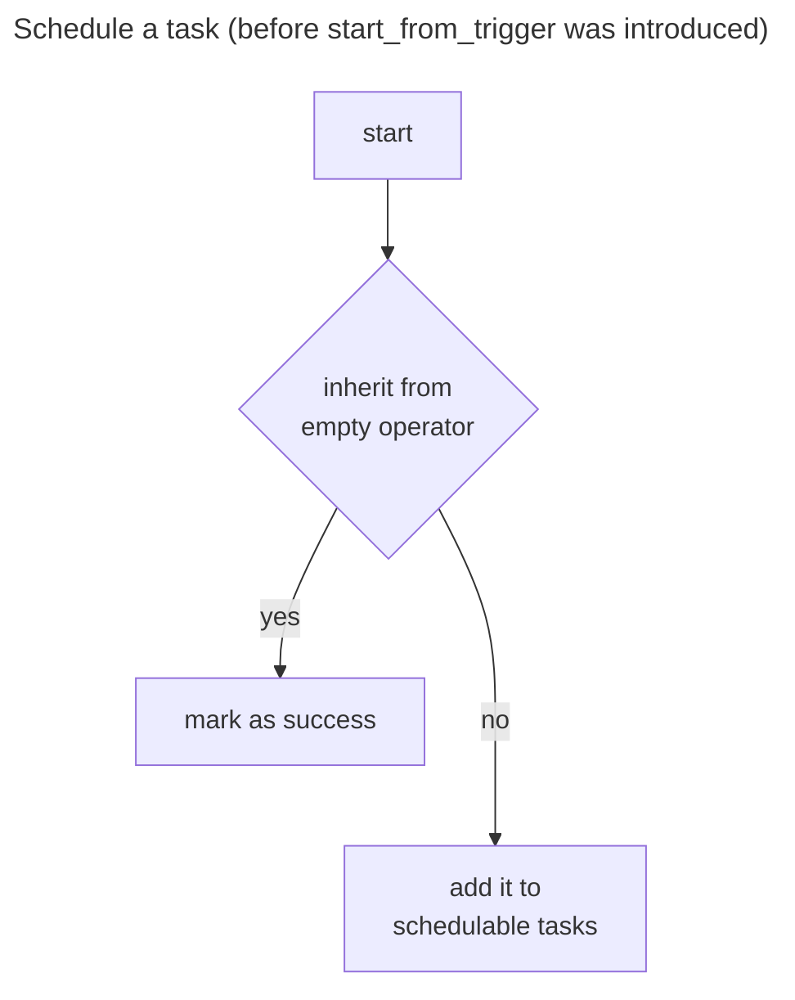
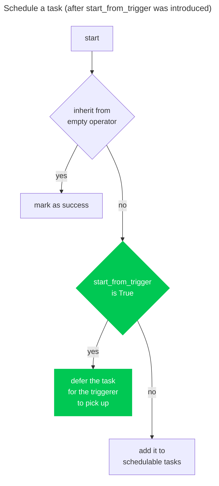

Title: Dynamic task mapping on operators that can start execution from trigger
Subtitle: This is not the feature you're looking for
Date: 2024-08-25 23:30
Category: Tech
Tags: Python, Airflow, Airflow 2.10
Slug: dynamic-task-mapping-on-operators-that-can-start-execution-from-trigger
Authors: Wei Lee
Series: What If...? Running Airflow Tasks without the workers
Cover: /images/posts-image/2024-dynamic-task-mapping-on-operators-that-can-start-execution-from-trigger/not-looking-for.jpg

As mentioned in [the first article of this series]({filename}/posts/tech/2024/7-airflow-start-execution-directly-from-trigger-instead-of-going-into-worker.md), dynamic task mapping was not supported before [this PR](https://github.com/apache/airflow/pull/39912). However, it's now supported.

Well... partially

<!--more-->

## What is dynamic task mapping anyway?

In short, it's a way to define multiple tasks at runtime. For example,

```python
with DAG(dag_id="dynamic_task_mapping", start_date=datetime(2022, 3, 4)) as dag:
    @task
    def sum(x: int, y: int, z: int):
        return x + y + z


    sum_values = sum.partial(y=10).expand(x=[1, 2], y=[300, 400])
```

will be interpreted as something like

```python
sum(y=10, x=1, y=300)
sum(y=10, x=2, y=300)
sum(y=10, x=1, y=400)
sum(y=10, x=1, y=300)
```

There are three methods you can use

* `partial`: add fixed values
* `expand`: add values to expand
* `expand_kwargs`: add values to expand but in bundles

The previous example can be modified to utilize `expand_kwargs`, and it will look like this

```python
with DAG(dag_id="dynamic_task_mapping", start_date=datetime(2022, 3, 4)) as dag:
    @task
    def sum(x: int, y: int, z: int):
        return x + y + z


    sum_values = sum.partial(y=10).expand_kwargs(
        [
            {"x": 1, "y": 300},
            {"x": 1, "y": 400},
            {"x": 2, "y": 300},
            {"x": 2, "y": 400},
        ]
```

For more details, please check [Dynamic Task Mapping](https://airflow.apache.org/docs/apache-airflow/2.10.0/authoring-and-scheduling/dynamic-task-mapping.html)

## Why can't it be supported directly?
If we look back to [commit 25616424975](https://github.com/apache/airflow/tree/25616424975e86f69cee35fb65c85283dcc0e245) (one commit before this PR), the decision on whether a task should be sent to the worker of the triggerer is made in [airflow/models/dagrun.py::DagRun::schedule_tis](https://github.com/apache/airflow/blob/25616424975e86f69cee35fb65c85283dcc0e245/airflow/models/dagrun.py#L1571-L1586) and it used `start_from_trigger` and `start_trigger_args` to do so. To visualize this, let's take a look at the following two flowcharts.

This is what Airflow did before the introduction of the "start execution from trigger" feature. We checked whether the task inherited from an [EmptyOperator](https://airflow.apache.org/docs/apache-airflow/2.10.0/_modules/airflow/operators/empty.html#EmptyOperator). If so, we marked it as a success. Otherwise, we added the task to the list of tasks to be scheduled.



Now, we add an additional check to see if `start_from_trigger` is set to True to determine whether to delay this task at this stage.



The issue is that when tasks are mapped, the scheduler does not execute their `__init__` method. We cannot determine the actual values of `start_from_trigger` and `start_trigger_args` until the task is initialized, which does not occur in the scheduler. If we only check these values at the class level, this feature becomes entirely useless, as we cannot map tasks with different values.

We are in a situation where we need these values to decide whether they should go to the worker or the triggerer, but we can only obtain them from the worker.


## What can we do?
There's not much we can do unless we rewrite the entire dynamic task mapping feature in Airflow. The following is pretty much the only workaround available at the moment.

Let's go back to [where we decide whether to defer or not](https://github.com/apache/airflow/pull/39912/files#diff-649fbbf224bab54417f03338c27d0fdb3c3336e53a522a13dfd9806c99f63137R1580-R1594). We implemented a new `expand_start_from_trigger` method and try to provide a way for the mapped operator to get `start_from_trigger.` For non-mapped operators, this method only returns `self.start_from_trigger`.

```python
            # check "start_trigger_args" to see whether the operator supports start execution from triggerer
            # if so, we'll then check "start_from_trigger" to see whether this feature is turned on and defer
            # this task.
            # if not, we'll add this "ti" into "schedulable_ti_ids" and later execute it to run in the worker
            elif ti.task.start_trigger_args is not None:
                context = ti.get_template_context()
                start_from_trigger = ti.task.expand_start_from_trigger(context=context, session=session)

                if start_from_trigger:
                    ti.start_date = timezone.utcnow()
                    if ti.state != TaskInstanceState.UP_FOR_RESCHEDULE:
                        ti.try_number += 1
                    ti.defer_task(exception=None, session=session)
                else:
                    schedulable_ti_ids.append((ti.task_id, ti.map_index))
```

For the mapped operator, it checks whether the argument `start_from_trigger` is passed through `partial`, `expand`, and `expand_kwargs` (the methods you need to use dynamic task mapping as mentioned in the "What is dynamic task mapping anyway?" section). If so, we'll use this value to decide whether to defer the task.

```python
    def expand_start_from_trigger(self, *, context: Context, session: Session) -> bool:
        """
        Get the start_from_trigger value of the current abstract operator.
        MappedOperator uses this to unmap start_from_trigger to decide whether to start the task
        execution directly from triggerer.
        :meta private:
        """
        # start_from_trigger only makes sense when start_trigger_args exists.
        if not self.start_trigger_args:
            return False

        mapped_kwargs, _ = self._expand_mapped_kwargs(context, session, include_xcom=False)
        if self._disallow_kwargs_override:
            prevent_duplicates(
                self.partial_kwargs,
                mapped_kwargs,
                fail_reason="unmappable or already specified",
            )

        # Ordering is significant; mapped kwargs should override partial ones.
        return mapped_kwargs.get(
            "start_from_trigger", self.partial_kwargs.get("start_from_trigger", self.start_from_trigger)
        )
```

Note that the argument name must be the same to take effect. If you're doing something like

```
def __init__(self, sft: bool):
    self.start_from_trigger = sft
```

It won't take effect as the mapped operator won't run `__init__` at that stage.

As for `self.start_trigger_args`, we're doing something similar. After we have already decided we want to defer the task, we use the newly added `expand_start_trigger_args` method to get the value needed [here](https://github.com/apache/airflow/pull/39912/files#diff-62f7d8a52fefdb8e05d4f040c6d3459b4a56fe46976c24f68843dbaeb5a98487R1621-R1631)

One last thing to note is that we're not resolving XCom for these 2 values.

## So how can we use it?
I intentionally don't include a table of contents in this article, and it starts with how this feature works under the hood instead of how to use it. If you don’t know if you need to combine this feature with dynamic task mapping, you don't.


This feature has some limitations. The syntax is slightly different from standard dynamic task mapping, which makes it easy to go wrong. Also, it does not resolve XCom when trying to expand `start_from_trigger` and `.start_trigger_arg`, which makes this feature less powerful.

Unless you know the risk and the difference between it and dynamic task mapping on standard operators.


**Warning: Proceed at your own risk.**

First, you'll need to define arguments `trigger_kwargs` explicitly and  `start_from_trigger` in the `__init__` method so Airflow can expand it in the scheduler.

```python
class WaitHoursSensor(BaseSensorOperator):
    start_trigger_args = StartTriggerArgs(
        trigger_cls="airflow.triggers.temporal.TimeDeltaTrigger",
        trigger_kwargs={"moment": timedelta(hours=1)},
        next_method="execute_complete",
        next_kwargs=None,
        timeout=None,
    )

    def __init__(
        self,
        *args: list[Any],
        trigger_kwargs: dict[str, Any] | None,
        start_from_trigger: bool,
        **kwargs: dict[str, Any],
    ) -> None:
        # This whole method will be skipped during dynamic task mapping.

        super().__init__(*args, **kwargs)
        self.start_trigger_args.trigger_kwargs = trigger_kwargs
        self.start_from_trigger = start_from_trigger

    def execute_complete(self, context: Context, event: dict[str, Any] | None = None) -> None:
        # We have no more work to do here. Mark as complete.
        return
```

When defining the task, you need to pass `start_from_trigger` or `trigger_kwargs` to the `partial`, `expand`, or `expand_kwargs` method. The name needs to be precisely the same.

```python
wait_hours_task = WaitHoursSensor.partial(
    task_id="wait_for_n_hours",
    start_from_trigger=True
).expand(
    trigger_kwargs=[
        {"hours": 1},
        {"hours": 2}
    ]
)
```

The entire `__init__` method will be disregarded before the task starts. The scheduler uses the values provided in these methods and saves them as a trigger row in the metadata database for the triggerer to pick up. Once the task is finished in the triggerer, it goes back to the scheduler and then gets assigned to a worker to execute the next method. *The `__init__` method will be run before the next method is executed.*
