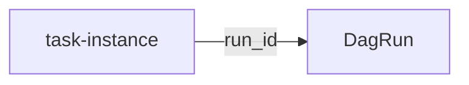

Title: AIP-83 - Rename execution_date -> logical_date and remove unique constraint
Date: 2024-11-19 19:30
Category: Tech
Tags: Python, Airflow, Airflow 3.0, Airflow Improvement Proposal, Digest
Slug: aip-83
Authors: Wei Lee
Series: 帶我讀 AIP

最近要 review 幾個 AIP-83 的 pull requests
重新回來整理一下筆記
避免 review 的時候搞不清楚狀況

<!--more-->

雖然這篇文發出來的時候， AIP-83 應該已經快完成了
但整理筆記到發文是需要時間的!

[TOC]

## TLDR
自從有了 `DagRun.run_id`，不需要 `exeuciton_date` 來分辨 dag run 了
可以移除 `exeuciton_date` 的 unique constraint
而且這個名字常常很誤導人，所以可以把它改名成 `logical date`

## Note

* [Link to AIP-83][AIP-83]

### Motivation
* Before the `DagRun` concept was introduced, Airflow used `execution_date` to distinguish dag runs, which is no longer needed

### Rationale
* How task instances look up dag runs now

### Proposal
* database migration
    * rename `execution_date` as `logical_date`
    * remove the unique constraint
* `executiion_date` needs to be removed in
    * arguments in Python functions
    * REST API
    * task execution context
* `logical date` can be shown in UI for humans to distinguish dag runs (not  technically unique)
* Generation of `run_id` should no longer rely on `logical_date`

### Compatibility and Migration
* what might break
    * log templates
        * configurations `task_log_prefix_template` and `log_filename_template`
    * custom configured template that still uses `execution_date`

## 雜談
整理這次的筆記時，我有注意避免用到大寫的 DAG (Dag is fine though)
自從[Airflow should deprecate the term "DAG" for end users]的討論
Airflow 社群決定把讓 Airflow dag 跟 directed acyclic graph 脫鉤
dag 自此之後就是一個 Airflow 的自創名詞
Airflow 3.0 也透過 [Rename DAG to Dag in new UI #43325] 把這件事從 UI 上改掉了

dag ✅
Dag ✅
DAG ❌

啊，還有另一件事
TP 寫的 AIP-83 其實蠻精練的
我用 Kindle 劃線註記的時候，都快把整篇畫起來了
也因此第一次達到劃線上限
（鄉野傳說說是一篇文章的 10 分之 1）
第一次知道 Kindle 有這種限制，雖然蠻合理的

[AIP-83]: https://cwiki.apache.org/confluence/display/AIRFLOW/AIP-83+Rename+execution_date+-%3E+logical_date+and+remove+unique+constraint
[Airflow should deprecate the term "DAG" for end users]: https://lists.apache.org/thread/lktrzqkzrpvc1cyctxz7zxfmc0fwtq2j
[Rename DAG to Dag in new UI #43325]: https://github.com/apache/airflow/pull/43325
