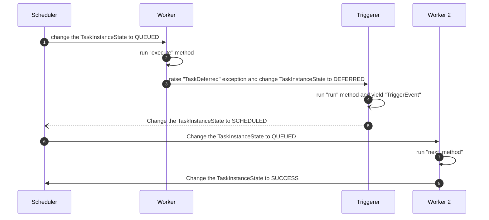
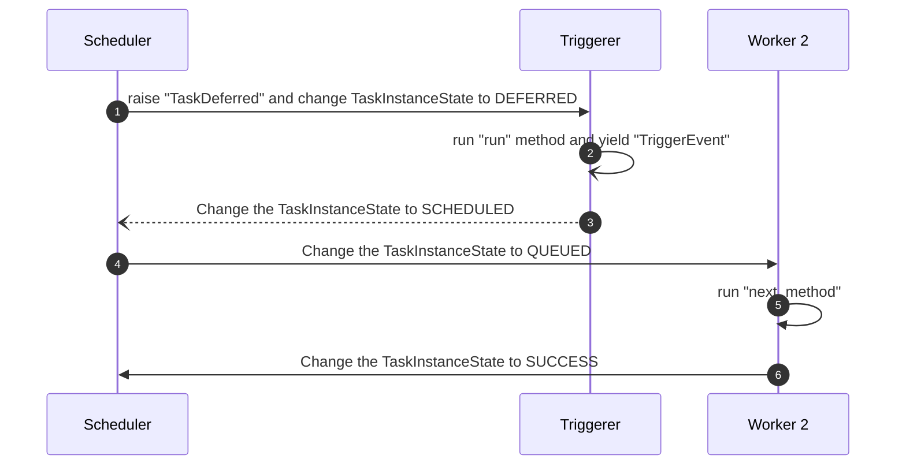
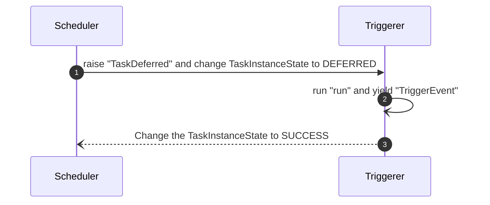

Title: Starts Airflow task execution directly from the triggerer
Date: 2024-06-02 18:20
Modified: 2024-07-30 23:55
Category: Tech
Tags: Airflow, Airflow 2.10, Triggerer
Slug: starts-execution-directly-from-triggerer-without-going-to-worker
Authors: Wei Lee

A few weeks ago, I submitted [#38674](https://github.com/apache/airflow/pull/38674) to [airflow](https://github.com/apache/airflow) to Airflow, which was later selected as the PR of the month. (Thanks, Kaxil, for the nomination!)

<!--more-->

Thus, I was invited to present this feature at the  [Airflow Monthly Town-Hall](https://astronomer.zoom.us/meeting/register/tZYqcOqhpjkqHdWPk_L11pHpUVLRHB4uYBSv#/registration). Here is the [slide](https://speakerdeck.com/leew/starts-airflow-task-execution-directly-from-the-triggerer) I used.

Even though this feature will not look the same after [#39585](https://github.com/apache/airflow/pull/39585), the core concept is similar, and I already finished 70% of this article before even creating that PR, so I still want to finish this writing 😆

[TOC]

## How did the deferrable operator work before this change?

When a task with `deferrable=True` is triggered, the [scheduler](https://airflow.apache.org/docs/apache-airflow/2.9.1/administration-and-deployment/scheduler.html) assigns a worker to run the `execute` method of the operator (e.g., [TriggerDagRunOperator](https://github.com/apache/airflow/blob/2d53c1089f78d8d1416f51af60e1e0354781c661/airflow/operators/trigger_dagrun.py#L73)). If the task runs [self.defer](https://github.com/apache/airflow/blob/2d53c1089f78d8d1416f51af60e1e0354781c661/airflow/operators/trigger_dagrun.py#L211) which raises a [TaskDeferred](https://github.com/apache/airflow/blob/2d53c1089f78d8d1416f51af60e1e0354781c661/airflow/models/baseoperator.py#L1684). The scheduler will change the task instance state to [deferred](https://github.com/apache/airflow/blob/e299ac91e2fddc709487aaaa4bb24162f77ba615/airflow/utils/state.py#L59C17-L59C25). Then the [triggerer](https://airflow.apache.org/docs/apache-airflow/2.9.1/authoring-and-scheduling/deferring.html) will pick up the task and run the task in an async manner. After finishing, the trigger `yield` a TriggerEvent. Then the scheduler will once again assign a worker to run this task and run the `next_method` which is usually named as `execute_complate`.

The current flow looks like this.



## Why do we want it?
If you take a look at [S3KeysUnchangedSensor](https://github.com/apache/airflow/blob/2d53c1089f78d8d1416f51af60e1e0354781c661/airflow/providers/amazon/aws/sensors/s3.py#L346-L367), the only thing that the [execute method](https://github.com/apache/airflow/blob/2d53c1089f78d8d1416f51af60e1e0354781c661/airflow/providers/amazon/aws/sensors/s3.py#L346-L367) do is pretty much just deferring. Thus, we don’t really to execute it from a worker and than defer it to triggerer. We can just start the execution from triggerer and change the flow to the following.



And, in some cases, we don’t even need to run “next_method” in the triggerer, so we probably could support skip “next_method” as well in the future.



## How does it affect DAG authors?
Well, not much at this moment. Ideally, everything should be the same but more efficient, and it might also open new opportunities for other use cases.

## How does it affect operator authors?
A new way to way to implement operators in an async manner

## Let's see how it looks like

Before this feature was added, to defer `WaitOneHourSensor`, we need to run call the `defer` method in `execute`.

```python
from datetime import timedelta
from typing import Any

from airflow.sensors.base import BaseSensorOperator
from airflow.triggers.temporal import TimeDeltaTrigger
from airflow.utils.context import Context


class WaitOneHourSensor(BaseSensorOperator):
    def execute(self, context: Context) -> None:
        self.defer(trigger=TimeDeltaTrigger(timedelta(hours=1)), method_name="execute_complete")

    def execute_complete(self, context: Context, event: dict[str, Any] | None = None) -> None:
        # We have no more work to do here. Mark as complete.
        return
```

Now, we can add `start_trigger` and `next_method` attributes and the scheduler will know we want to execute this task directly from the triggerer.

```python
from datetime import timedelta
from typing import Any

from airflow.sensors.base import BaseSensorOperator
from airflow.triggers.temporal import TimeDeltaTrigger
from airflow.utils.context import Context


class WaitOneHourSensor(BaseSensorOperator):
    def __init__(self, *args: list[Any], **kwargs: dict[str, Any]) -> None:
        super().__init__(*args, **kwargs)
        self.start_trigger = TimeDeltaTrigger(timedelta(hours=1))
        self.next_method = "execute_complete"

    def execute_complete(self, context: Context, event: dict[str, Any] | None = None) -> None:
        # We have no more work to do here. Mark as complete.
        return
```

## How does it work under the hook

Let's take a look at [airflow/models/dagrun.py](https://github.com/apache/airflow/blob/3d97474a49a00bb6fcd67cf20d470a1fc2861f4f/airflow/models/dagrun.py#L1541-L1553)

```python
            elif (
                ti.task.start_trigger is not None
                and ti.task.next_method is not None
                and not ti.task.on_execute_callback
                and not ti.task.on_success_callback
                and not ti.task.outlets
            ):
                if ti.state != TaskInstanceState.UP_FOR_RESCHEDULE:
                    ti.try_number += 1
                ti.defer_task(
                    exception=TaskDeferred(trigger=ti.task.start_trigger, method_name=ti.task.next_method),
                    session=session,
                )
```

It checks whether a task has both `start_trigger` and `next_method` set. If so, we'll defer this task by calling `defer_task` instead of adding it to `schedulable_ti_ids.` (The `on_execute_callback`, `on_success_callback`, and `outlets` checks are actually wrong and are addressed in [#39585](https://github.com/apache/airflow/pull/39585)).

## Limitation
Dynamic Task Mapping / MappedOperator is not fully supported at this time due to the way this type of operator is initialized on the worker. However, a draft PR [#39912](https://github.com/apache/airflow/pull/39912) has been created to address this.
