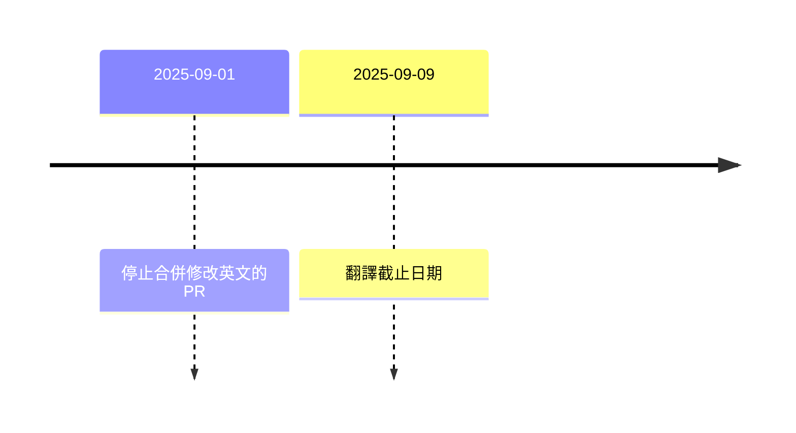

Title: Airflow 3.1 RC 出來前，你各位要好好翻譯啊
Date: 2025-08-19 21:35
Category: Tech
Tags: Airflow, Airflow 開發生情報
Slug: complete-i18n-locales-for-airflow-3-1-RC
Authors: Wei Lee

為了讓自己更有動力好好的讀 Airflow 開發郵件群組 (Airflow dev mailing list)
多開了 [Airflow 生情報](/tag/airflow-kai-fa-sheng-qing-bao.html) 的標籤
會不會跟其他發個一篇就沒有下一篇的文一樣撐不過第二篇不知道
但先來試試看水溫

<!--more-->

因為是生情報，可能都還沒有結論就會我記錄下來
就算討論有結論了，也可能在開發階段又有改變
請小心服用

原文 👉 [[REMINDER] Complete i18n locales for Airflow 3.1 RC by Sep. 9, 2025](https://lists.apache.org/thread/fn1qsgonkmt6d34mxlwtj71c7142r1b5)

## 本文
Airflow 3.1 即將支援多國語言
Shahar 大大提醒你各位，快點翻譯啊

* 已支援
    * 荷蘭語 - 100%
    * 希伯來語 - 100%
    * 阿拉伯語 - 100%
    * 韓文 - 100%（在合併 #54611 之後）
    * 台灣漢語 - 99.5%
    * 德語 - 98.6%
    * 波蘭語 - 98.6%
    * 西班牙語 - 87.6%
    * 法語 - 86.8%
* 可能會支援（PR 還沒被合併）
    * 葡萄牙語 - 90.1% (#52341)
    * 義大利文 - 90.1% (#52342)
* 時程

## 我怎麼想
沒想到第一個支援，而且已經很積極在維護的台灣漢語竟然不是 100%

嚇得我馬上開一個 PR [feat(i18n): add missing Taiwanese Mandarain translations #54653](https://github.com/apache/airflow/pull/54653)
剛剛被合併了，現在是 100% 了

## Reference
* [JOJO 的奇妙冒險 星塵遠征軍](https://ani.gamer.com.tw/animeVideo.php?sn=6271)
