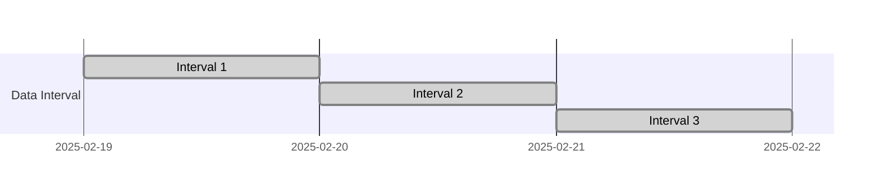

Title: AIP-83 修正案
Subtitle: 把 execution date 都移掉，我們就能自由了嗎
Date: 2025-02-20 22:50
Modified: 205
Category: Tech
Tags: Airflow, Airflow 3.0, Airflow Improvement Proposal
Slug: aip-83-amendment
Authors: Wei Lee
Cover: /images/meme/aot-freedom.png
Series: 帶我讀 AIP

海（？）的對面是 backfill 跟 data completeness

<!--more-->

這次是之前的談到的 [AIP-83 - Rename execution_date -> logical_date and remove unique constraint] 的修正案

主要包含以下兩份文件

1. [AIP-83 amendment to support classic Airflow authoring style] : 修正案本身，包含了問題跟修正的方向
2. [Option 2 clarification doc WIP] : 針對共識修正方案的細節補充

以下是我看完它們做的一些筆記
之前就因為雖然看過，但忘了記了細節，問了蠢問題...
腦袋不好，不做筆記還是不行呢

---

## AIP-83 修正案

### 前言
AIP-83 中， `exeuction_date` 已經被重新命名為 `logical_date`
所以文件中不會再出現 `exeuction_date`

> 當初認真要學 Airflow 的概念時， execution_date 確實是困惑中最困惑的

最初設計 `logical_date` 的其中一個用途是去找 dag run
但現在有 `run_id` 了，所以不再需要了
而另外一個用途是將 dag runs 切隔成不同的區間（partition）

e.g.,

第一個 dag run 的 `logical_date` 就會是 `2025/02/19`
表示的是 `2025/02/19` ~ `2025/02/20` 這個區間
以此延伸概念

* backfill: 去跑某個區間
* catchup: 確保每個區間都有跑過了

這大致上是 data completeness 的概念
至於這個概念是不是常被大家所使用，不知道，可能很少
Daniel (修正案提案者之一) 說自己以前是 Data Engineer 的時候，也沒用過
大多用到的是 incremental 或 full refresh

> 我還在樂天當 ML Engineer 的時候，也是只有用 incremental 跟 full refresh

但 data completeness 本身沒有錯，也許也真的有人在用
所以不能就這樣讓它壞掉

~~目標，武道館~~

**目標： 讓 data completeness 的概念不要壞掉，但不用是 Airflow 的預設行為**

### 誒不是？怎麼突然就要壞掉了 🤯
1. AIP-83 以前可以透過 unique `logical_date` 找到 dag_run，現在不行了
    * 可能有很多個具有相同 `logical_date` 的 dag runs
        * 不知道哪個區間還沒有完成
            * 那不知道要怎麼做 backfil 跟 catchup
2. backfill 的範圍有 10 個 dag runs 都是同樣的日期怎麼辦？
    * 全部重跑嗎？
    * 跑最新的嗎？
        * 哪個是最新的？
            * 看 `start_date`?
            * 看 `end_date`?
3. `depends on past` 如果有 3 個同 `logicate_date` 的 dag run，哪個才是過去？命運石之門該選擇誰？
4. 如果要從前一個 dag run 取 xcom， "前一個 dag run" 是什麼呢？
5. grid view 當初就是為了 data completeness 的概念設計，如今禮樂崩壞，又該如何顯示呢？

### 躺著也中槍的 data intervals
如果 dag 不是為了 `logical_date` 而跑，那 data interval 就沒意義了
這也是順著 data completeness 而生的產物

如果是手動或 dataset/asset 觸發 的 dag runs， 它們的 data interval 應該是什麼呢？
為它們賦予 data interval 有總有種為賦新詞強說愁的感覺

### 該付出什麼才能讓一天平安的過去
以下是修正案中的 5 個提案

1. 讓 `logical_date` uniqueness 回來， just like the good old days
2. 讓 `logical_date` uniqueness 回來，但可以是 null
3. 讓使用者在 dag 裡面定義 partition
4. 雙手一攤，什麼都不做
5. 讓 backfill 跟 depends on past 的行為 configurable

最後大家的選擇是選項 2

## Option 2 執行細節

### 沒爭議的決定
* `logical_date`
    * uniqueness 復活！
    * 可以是 null
    * 沒有 `logical_date` 的 dag runs 不會有 timetables

### 爭議與他們的結論

1. 手動觸發 dag runs 中的 `logical_date`
    1. UI
        * 舊 UI: 維持原樣（話說回來，舊 UI 也要移除了 → [[DISCUSS] Time to say goodbye to the old UI?][airflow dev list bye old UI]
        * 新 UI: 預設為 None，但可以透過 date picker 選日期
    2. REST API
        * 舊 API: API 會被移除
        * 新 API: `logical_date` 將是必填，但可以是 null
    3. `TriggerDagRunOperator`
        * 預設為 None，但使用者可以提供
    4. CLI (`airflow dags trigger`)
        * 預設為 None，但使用者可以提供
2. Data asset 觸發 dag runs 中的 `logical_date`
    1. 不會有 `logical_dates` 跟 data interval
    2. 如果是 schedule + asset 觸發的 dag 呢？
        * data asset 觸發 的 dag runs 比照 2-1
    3. 在 template 跟 context 將無法取得 `logical_date`，而且要丟出例外
3. UI 上 dag runs 該怎麼排序
    1. 新增 `run_after` 欄位， 表示 dag run 最早可以被執行的時間
    2. 並用預設用 `run_after` 作為排序
4. Data interval
    1. Asset 觸發 dag runs 不會有 `logical_date`, `data_interval_start`,  `data_interval_end` (其實跟 2-1 重複了)
    2. 手動觸發 dag runs
        1. dag 本身如果是
            1. schedule-driven: 而且 logical_date 有被提供，就給 data interval
            2. asset-driven: 沒有 data interval
5. 如果 dag run 沒有 `logical_date` ，那 template 跟 context 該怎麼辦？
    * 嘗試去要 `logical_date` 要丟出例外 (跟 2-3 一樣)
6. 沒有 `logical_date` 的 dag run 的 `run_id` 該怎麼產生
    * 後綴改成 *run_after + 隨機字串*
7. 如果 API 過濾一個 `logical_date` 範圍的 dag runs 怎麼辦
    * xcom_pull
        * 設定 `include_prior_dates=True` 是沒用的
    * clear
        * 過濾 `logical_date` 範圍的參數將被無視
    * 如果 `logical_date` 有被提供，沒有 `logical_date` 的 dag runs 全部會被無視
    * 原本過濾 `logical_date` 都行為都不會改變，沒有 `logical_date` 的 dag runs 則是自動被跳過

---

## 結語
重新再做過一次筆記，又讓我對整個概念更熟悉了不少
當初 `execution_date` 這個命名還是太令人困惑了
`logical_date` 又有點抽象，有點玄
體感上，好像比較接近 partition ID？

雖然一開始就做好我看得懂筆記了（畢竟工作上要用）
但要稍微順過後發出來，還是意外花了點時間
這次我克制自己少用萬用 MyGO!!!!! 梗，以維持我對其他梗圖的熟悉度（？？？？？）

[AIP-83 - Rename execution_date -> logical_date and remove unique constraint]: {filename}/posts/tech/2024/24-aip-83.md
[AIP-83 amendment to support classic Airflow authoring style]: https://cwiki.apache.org/confluence/display/AIRFLOW/AIP-83+amendment+to+support+classic+Airflow+authoring+style
[Option 2 clarification doc WIP]: https://cwiki.apache.org/confluence/display/AIRFLOW/Option+2+clarification+doc+WIP
[airflow dev list bye old UI]: https://lists.apache.org/thread/orww9dcx2bc5jjd1xlzj8nk89xorxqsf
