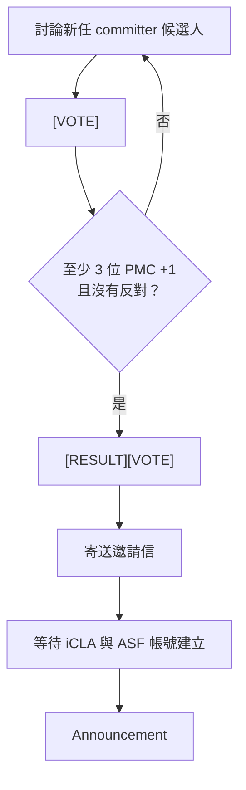

Title: 第一次公布 Apache Airflow 新任 committer ⭐
Subtitle: 戒慎恐懼
Date: 2026-07-03 08:20 +0800
Category: Tech
Tags: Airflow, Airflow 開發生情報
Slug: my-first-committer-announcement
Authors: Wei Lee
Lang: zh-tw

這是我當上 Apache Airflow 的 PMC 成員後
第一次要負責邀請新的 committer，並向整個社群公告
戒慎恐懼 😱

<!--more-->

👉 原文: [New committer: Przemysław Mirowski and Henry Chen](https://lists.apache.org/thread/x0lznm4korqdc5o1dmpf2v050o9vr2tl)

首先，讓我們恭喜 Przemysław Mirowski 跟 Henry Chen 成為新一輪的 committer 🎉
這已經是連續兩輪都有台灣的社群朋友當上 committer 了！！！

這篇主要想記錄的是 PMC 成員在這個流程中會做哪些事情
對應到官方文件中的 [New Committer Process](https://community.apache.org/pmc/adding-committers.html#new-committer-process)

1. PMC 成員討論新一輪的 committer 候選人
2. 有共識後，寄出 `[VOTE]` 郵件開始投票
3. 若投票獲得至少三個 +1，且沒有反對票，再寄出 `[RESULT][VOTE]`

接下來每個 Apache 底下的專案會稍有不同
這也是為什麼我稍微緊張，怎麼大家的做法都不一樣 😱

Apache Airflow 則是有個[New Committer Onboarding Steps](https://github.com/apache/airflow/blob/main/COMMITTERS.rst#new-committer-onboarding-steps)
雖然看起來像是 committer 跑的流程跟 PMC 成員無關，但實際上也真的是 😆
大部分的流程都是收到邀請的 committer 自己要跑
不是 ASF 成員的 PMC 成員能做的就只有等待
（ASF 成員可以主動去一個地方確認）
等到收到通知受邀請者都同意了，而且帳號也創好了
就可以發信件到 [Airflow 開發者群組](https://lists.apache.org/list.html?dev@airflow.apache.org) 公告了！

等到收到通知，確認受邀者都接受邀請、ASF 帳號也建立完成後，就輪到 PMC 成員寄出 announcement mail。
以前都是收到 announcement mail，這次終於變成寄信的人了。

